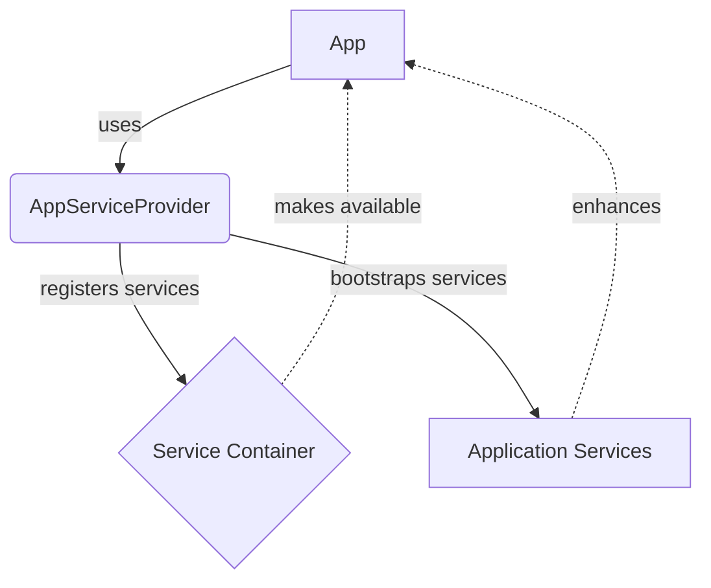

## Module: AppServiceProvider.php
Based on the provided code snippet, let's break down the analysis of the `AppServiceProvider.php` module.

### Module Name
The module is named `AppServiceProvider`.

### Primary Objectives
The primary purpose of the `AppServiceProvider` is to serve as a place to register and boot application services. It's a part of the service container mechanism in Laravel, which is used for service registration and bootstrapping services that the application will use.

### Critical Functions
- `register()`: This method is used to bind services into the service container before the application starts. It's where you can register custom service providers, or bind interfaces to implementations.
- `boot()`: This method is called after all other service providers have been registered, meaning you have access to all other services that have been registered by the framework.

### Key Variables
There are no explicit key variables defined within the provided methods; however, the class itself acts as a key component within the Laravel framework for service registration and bootstrapping.

### Interdependencies
`AppServiceProvider` interacts with Laravel's service container, a powerful tool for managing class dependencies and performing dependency injection. It depends on other components of the Laravel framework, specifically those involved in the registration and bootstrapping of services.

### Core vs. Auxiliary Operations
- **Core Operations**: Both `register()` and `boot()` methods are core operations of the `AppServiceProvider`. They are essential for the functioning of the Laravel application, allowing for service registration and initialization.
- **Auxiliary Operations**: The provided code snippet does not explicitly define any auxiliary operations. However, in a broader context, auxiliary operations might include methods that help in configuring or modifying the behavior of registered services.

### Operational Sequence
The operational sequence in the context of the `AppServiceProvider` involves first calling the `register()` method during the application's startup phase to bind services into the Laravel service container. Following this, the `boot()` method is called to initialize these services or perform actions that require all other services to be registered.

### Performance Aspects
Performance considerations for `AppServiceProvider` mainly involve ensuring that the services registered and actions performed within the `boot()` method are optimized for speed and resource usage, as these can impact the overall performance of the Laravel application.

### Reusability
The `AppServiceProvider` is highly reusable in the sense that it can be customized to register and bootstrap various types of services needed across different Laravel applications. It provides a centralized location for service configuration.

### Usage
`AppServiceProvider` is used by adding service binding and bootstrapping logic within its `register()` and `boot()` methods, respectively. This can include registering service classes, setting up configuration values, and performing initializations that need to happen before the application handles a request.

### Assumptions
- The Laravel framework's service container is available and operational.
- Other service providers have been loaded before the `boot()` method is called, as it may depend on services registered by them.
- The developer understands the difference between registering and bootstrapping services, as well as when to use each method.

This analysis outlines the functionalities and considerations of the `AppServiceProvider` within a Laravel application, highlighting its role in service management and initialization.
## Flow Diagram [via mermaid]

