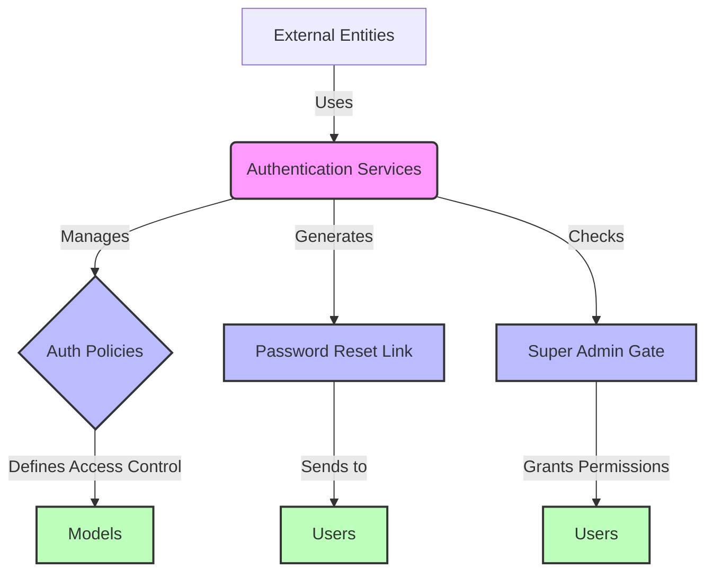

## Module: AuthServiceProvider.php
Based on the provided code for the `AuthServiceProvider.php` module, here is a comprehensive analysis:

### Module Name
`AuthServiceProvider`

### Primary Objectives
The primary purpose of the `AuthServiceProvider` is to register and manage authentication and authorization services within a Laravel application. It handles the mapping of policies to models, customizes parts of the authentication process, and sets up gates for permission checks.

### Critical Functions
- `boot()`: This method is where policies are registered, custom URL creation for password resets is defined, and global before checks (e.g., checking for a "Super Admin" role) are set up for gates.

### Key Variables
- `$policies`: An array mapping Eloquent models to their authorization policy classes. This variable is crucial for defining which policies apply to which models, facilitating authorization checks throughout the application.

### Interdependencies
- **Laravel's Auth System**: This service provider interacts closely with Laravel's built-in authentication and authorization systems, utilizing classes like `Gate` and notifications such as `ResetPassword`.
- **Application Models and Policies**: Specifically, it depends on the `User` model and its corresponding `UserPolicy`, as indicated in the `$policies` array, though the code suggests it can be extended to other models and policies.

### Core vs. Auxiliary Operations
- **Core Operations**: Registering policies and setting up the global gate checks are core functionalities, as they are essential for the module's purpose of managing authorization.
- **Auxiliary Operations**: Customizing the password reset URL could be considered an auxiliary operation, as it enhances the user experience but is not central to authorization management.

### Operational Sequence
1. **Policy Registration**: Upon booting, the service provider registers model-policy mappings.
2. **Custom Password Reset URL**: It then customizes the password reset URL for the application.
3. **Global Gate Checks**: Finally, it establishes a global gate check for granting "Super Admin" roles all permissions implicitly.

### Performance Aspects
- Efficient use of Laravel's authorization features, like gates and policies, helps maintain good performance by avoiding unnecessary checks and streamlining permission logic.
- The use of a global gate check for "Super Admin" roles can improve performance by short-circuiting permission checks for these users.

### Reusability
- The service provider is highly reusable across Laravel applications, as it abstracts common authorization tasks (e.g., policy registration, customizing password reset URLs) into a centralized location.

### Usage
This module is used within a Laravel application to manage authentication and authorization services. It is automatically loaded and executed by Laravel's service container, ensuring that authorization policies and customizations are applied globally across the application.

### Assumptions
- The application uses Laravel's built-in authentication and authorization systems.
- There is a "Super Admin" role that is implicitly granted all permissions.
- The application has a frontend URL defined in its configuration (`config('app.frontend_url')`), which is used for generating password reset URLs.
- Users have a method `hasRole()` to check for specific roles, which is not part of Laravel's default User model and suggests a custom implementation or the use of a package that extends user capabilities.
## Flow Diagram [via mermaid]

