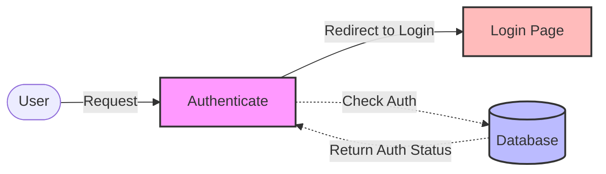

## Module: Authenticate.php
Based on the provided code snippet, here is a comprehensive analysis of the `Authenticate` module:

- **Module Name**: The module is named `Authenticate`.

- **Primary Objectives**: The primary purpose of this module is to handle user authentication within a web application. It determines the redirection path for unauthenticated users, ensuring that only authenticated users can access certain resources.

- **Critical Functions**:
    - `redirectTo(Request $request): ?string`: This method determines the URL to which an unauthenticated user should be redirected. It plays a crucial role in handling access control by redirecting users who are not authenticated to the login page, or by not redirecting at all if the request expects a JSON response (indicating an API request).

- **Key Variables**: 
    - No explicit variables are defined in this snippet outside of method parameters. However, the `$request` parameter in the `redirectTo` method is essential for determining the appropriate action based on the request type.

- **Interdependencies**:
    - This module extends `Illuminate\Auth\Middleware\Authenticate`, indicating a dependency on Laravel's authentication middleware framework. This inheritance means it relies on the broader authentication system provided by Laravel.
    - It interacts with the `Request` object and the routing system (`route('login')`) to determine redirection paths.

- **Core vs. Auxiliary Operations**:
    - Core Operations: The core operation of this module is the `redirectTo` method, which controls the redirection of unauthenticated users.
    - Auxiliary Operations: There are no explicit auxiliary operations defined in this snippet, but one could consider the integration with Laravel's routing and authentication systems as supporting operations.

- **Operational Sequence**:
    - When middleware intercepts an unauthenticated request, it invokes the `redirectTo` method to determine the appropriate redirection URL. The decision is based on whether the request expects a JSON response.

- **Performance Aspects**:
    - Performance considerations for this module are minimal, as it primarily involves conditional logic and a redirection operation. However, efficient handling of requests and redirections is crucial for maintaining a responsive user experience.

- **Reusability**:
    - The module is designed with a specific purpose in the context of Laravel's authentication system but can be adapted or extended for similar web applications that require user authentication and redirection mechanisms.

- **Usage**:
    - This module is used as middleware in a Laravel application. It is attached to routes or route groups that require user authentication, ensuring that unauthenticated requests are appropriately redirected.

- **Assumptions**:
    - The module assumes that there is a named route (`'login'`) to which unauthenticated users can be redirected.
    - It assumes that the application distinguishes between web and API requests, as indicated by the expectation of a JSON response for some requests.

This analysis provides a detailed overview of the `Authenticate` module within a Laravel application, highlighting its role in managing access control through user authentication and redirection.
## Flow Diagram [via mermaid]

