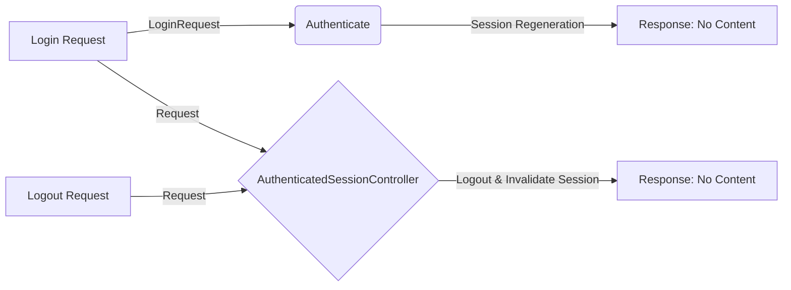

## Module: AuthenticatedSessionController.php
Based on the provided code for `AuthenticatedSessionController.php`, here is a comprehensive analysis:

- **Module Name**: `AuthenticatedSessionController`

- **Primary Objectives**: This module is designed to manage user sessions within a web application, specifically handling user authentication requests and the destruction of authenticated sessions. Its primary purpose is to facilitate secure login and logout functionalities.

- **Critical Functions**:
    - `store(LoginRequest $request)`: Handles incoming authentication requests. It authenticates the user, regenerates the session to prevent session fixation attacks, and returns a response indicating the request has been processed but does not contain any content.
    - `destroy(Request $request)`: Destroys an authenticated session by logging out the user, invalidating the session, regenerating the session token for security, and returning a response indicating the request has been processed but does not contain any content.

- **Key Variables**:
    - Not explicitly mentioned, but the use of `$request` in both methods is critical for accessing request data and managing the session.

- **Interdependencies**:
    - `LoginRequest`: A custom request class likely extending the base request class with additional validation rules or methods for authentication.
    - `Auth`: Facade used to access Laravel's authentication features, specifically to log out users.
    - `Controller`: The base controller class that `AuthenticatedSessionController` extends, providing common controller functionalities.

- **Core vs. Auxiliary Operations**:
    - **Core Operations**: Authenticating users (`store` method) and logging out users (`destroy` method) are the core functionalities.
    - **Auxiliary Operations**: Session management tasks like regenerating the session and the token are auxiliary but essential for security.

- **Operational Sequence**:
    1. **Authentication (store)**: Receive authentication request -> Authenticate user -> Regenerate session -> Return response.
    2. **Session Destruction (destroy)**: Receive logout request -> Logout user -> Invalidate session -> Regenerate token -> Return response.

- **Performance Aspects**:
    - Efficient session management is crucial for performance, especially in high-traffic applications. Regenerating sessions and tokens can add overhead, so it's important that these operations are optimized.
    - The use of built-in Laravel functionalities (like `Auth::guard`) ensures that the module benefits from the framework's optimization for handling authentication efficiently.

- **Reusability**:
    - This module is highly reusable for any Laravel-based application requiring user authentication and session management. Its adherence to Laravel's conventions means it can be easily adapted or extended.

- **Usage**:
    - This controller would be used in a Laravel web application, typically routed to handle login and logout URLs. It provides the endpoints for user authentication processes.

- **Assumptions**:
    - The application uses Laravel's built-in authentication mechanisms.
    - `LoginRequest` contains necessary validation or authentication logic specific to the application's requirements.
    - The application uses a web guard for authentication, as indicated by the use of `Auth::guard('web')`.
## Flow Diagram [via mermaid]

