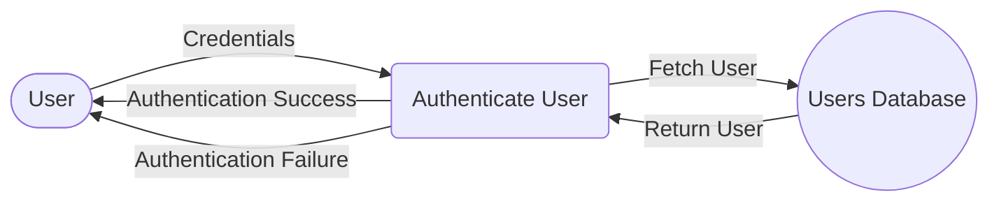

## Module: AuthenticationTest.php
Based on the provided code snippet, here's a comprehensive analysis of the `AuthenticationTest` module:

- **Module Name**: `AuthenticationTest`

- **Primary Objectives**: The primary purpose of this module is to test the authentication functionality of an application, ensuring users can log in with valid credentials and are prevented from logging in with invalid ones.

- **Critical Functions**:
  - `test_users_can_authenticate_using_the_login_screen()`: Tests that users can log in using the correct credentials.
  - `test_users_can_not_authenticate_with_invalid_password()`: Ensures that users cannot log in using an incorrect password.

- **Key Variables**:
  - `$user`: An instance of the `User` model, representing a simulated user for testing purposes.

- **Interdependencies**:
  - `App\Models\User`: This model is crucial for creating user instances for authentication tests.
  - `Illuminate\Foundation\Testing\RefreshDatabase`: Ensures a fresh database state for each test, preventing data persistence from affecting test outcomes.

- **Core vs. Auxiliary Operations**:
  - **Core Operations**: The core operations include testing successful authentication and failed authentication due to incorrect password.
  - **Auxiliary Operations**: The use of `RefreshDatabase` for maintaining database state and the setup of user instances for testing are auxiliary, supporting the core testing operations.

- **Operational Sequence**:
  - Each test function follows a sequence of creating a user, attempting authentication, and then asserting the expected outcome (authenticated or guest state).

- **Performance Aspects**:
  - The use of `RefreshDatabase` can impact test performance due to the overhead of resetting the database state before each test. However, this is crucial for test reliability.

- **Reusability**:
  - The testing patterns and methods used in this module can be adapted for other feature tests within the same application, especially those requiring user authentication.

- **Usage**:
  - This module is used during the development and maintenance phases of the application lifecycle to ensure that authentication mechanisms work as expected.

- **Assumptions**:
  - It assumes that the user model and authentication system are correctly set up and functioning.
  - It assumes the default password for the created user instance is 'password', which is a common practice for testing environments but should not be used in production.
  - It assumes that the application's routing and authentication logic correctly handle the '/login' endpoint.

This module is a critical component of the application's testing suite, focusing on security and user access integrity by verifying the authentication process. Its design reflects standard practices in automated testing for web applications, emphasizing the importance of both positive and negative testing scenarios.
## Flow Diagram [via mermaid]

