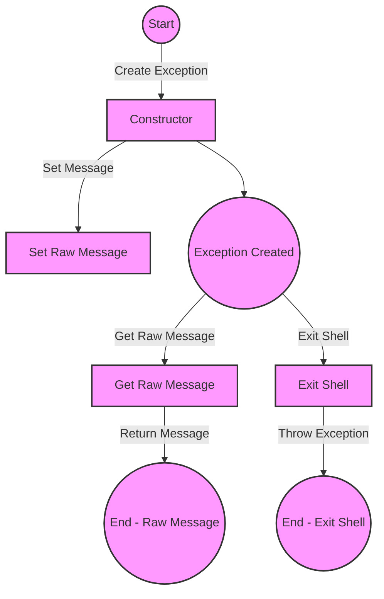

## Module: BreakException.php
Based on the provided code snippet, here's a comprehensive analysis:

- **Module Name**: The module is identified as `BreakException.php`.

- **Primary Objectives**: Its purpose is to define a custom exception handling mechanism specifically designed to halt the Psy Shell operation. This is particularly useful in a shell environment for gracefully terminating sessions based on specific conditions or user commands.

- **Critical Functions**:
  - `__construct($message = '', $code = 0, \Throwable $previous = null)`: Constructor method that initializes a new instance of the `BreakException` class, setting up the exception message and optionally a code and a previous exception for chaining.
  - `getRawMessage()`: Returns the raw, unformatted error message that was passed to the exception.
  - `exitShell()`: A static method that facilitates the throwing of the `BreakException`, effectively used to signal an exit from the Psy Shell.

- **Key Variables**:
  - `$rawMessage`: A private variable that stores the raw, unformatted message provided at the time of the exception's construction.

- **Interdependencies**: This module interacts with the broader exception handling system of PHP (`xception` and `\Throwable`) and is specifically designed to integrate with Psy Shell's operational mechanics, indicating a dependency on the Psy Shell environment and its error handling architecture.

- **Core vs. Auxiliary Operations**:
  - Core Operations: The construction of the exception and the ability to retrieve the raw message are fundamental to its purpose.
  - Auxiliary Operations: The `exitShell()` method serves an auxiliary function by providing a convenient wrapper for throwing the exception.

- **Operational Sequence**: The typical flow involves instantiating the `BreakException` (either directly or via `exitShell()`) when a condition is met that requires halting the Psy Shell. The exception is then caught by the shell's error handling mechanism, which processes the exit request.

- **Performance Aspects**: Given its role, performance considerations are likely minimal, focusing instead on correct function and integration within the Psy Shell's error handling framework. However, efficient exception handling is crucial in maintaining the shell's responsiveness.

- **Reusability**: The class is specifically designed for use within the Psy Shell environment. While the concept of a break exception could be adapted for use in other contexts, this particular implementation is tailored to Psy Shell's requirements.

- **Usage**: It is used within Psy Shell to gracefully terminate the shell session upon specific user commands or conditions, providing a mechanism for clean exit and resource deallocation.

- **Assumptions**:
  - The module assumes it operates within the Psy Shell environment.
  - It assumes that catching and handling of the exception is properly implemented elsewhere in the Psy Shell.
  - The design implies that a simple, unformatted message suffices for the purpose of the exception, given the method to retrieve the raw message.

This analysis outlines the `BreakException.php` module's role within the Psy Shell, highlighting its use for controlled shell termination and its integration within the shell's broader exception handling framework.
## Flow Diagram [via mermaid]

