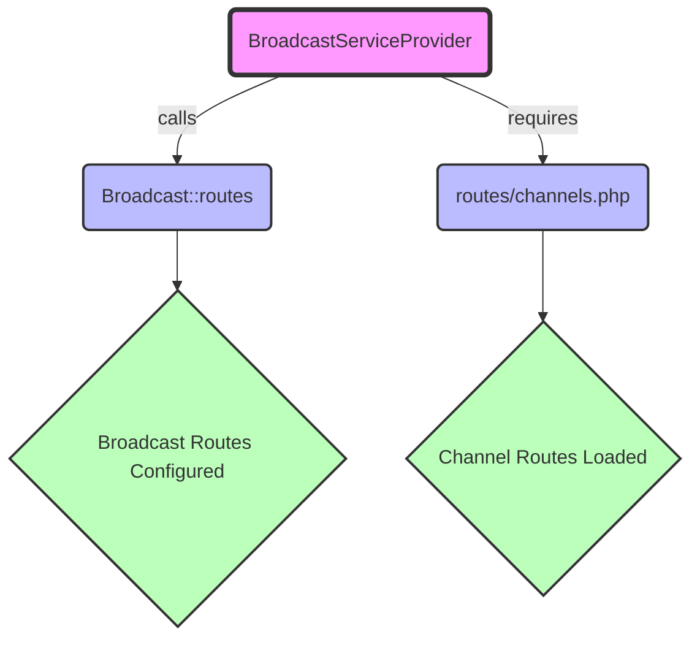

## Module: BroadcastServiceProvider.php
Based on the provided code snippet, here's a comprehensive analysis:

### Module Name
The module is identified as `BroadcastServiceProvider.php`.

### Primary Objectives
The primary purpose of this module is to bootstrap broadcasting services within a Laravel application. It is responsible for registering the necessary routes for broadcasting channels.

### Critical Functions
- `boot()`: This is the main method of the `BroadcastServiceProvider` class. Its role is to set up the broadcasting routes by calling `Broadcast::routes()` and to include the channel definitions by requiring the `channels.php` file located in the routes directory.

### Key Variables
There are no explicit custom variables defined within this snippet. However, the use of the `Broadcast` facade is key to its functionality.

### Interdependencies
- **Laravel Framework**: This service provider is tightly integrated with Laravel's service container and broadcasting capabilities.
- **Broadcast Facade**: Utilizes Laravel's `Broadcast` facade to define broadcasting routes.
- **channels.php**: Depends on the external file `channels.php` for the actual channel definitions.

### Core vs. Auxiliary Operations
- **Core Operations**: The core operation is the bootstrapping of broadcasting services, specifically setting up routes and loading channel definitions.
- **Auxiliary Operations**: There are no explicit auxiliary operations within this snippet, as its sole focus is on initializing broadcast capabilities.

### Operational Sequence
1. The `boot` method is automatically called by Laravel's service container during the application's bootstrapping process.
2. `Broadcast::routes()` method is called to register the necessary routes for broadcasting.
3. The `channels.php` file is required to ensure that the application's channel definitions are loaded.

### Performance Aspects
- **Efficiency**: The module is designed to be lightweight and efficient, as it directly leverages Laravel's built-in methods for its operations.
- **Scalability**: The performance impact is minimal and scales well with the application, as broadcasting setup is typically a one-time operation during the application's bootstrapping phase.

### Reusability
The `BroadcastServiceProvider` is highly reusable within the context of Laravel applications that require broadcasting capabilities. It serves as a template for setting up broadcast services and can be customized as needed by modifying the `channels.php` file.

### Usage
This service provider is used to enable real-time event broadcasting in a Laravel application. It is part of the application's service provider array, automatically called during the bootstrapping process to configure broadcasting routes and channel authorization.

### Assumptions
- The application is using Laravel's broadcasting capabilities.
- The `channels.php` file exists at the specified path and contains valid channel definitions.
- The Laravel application is configured correctly to support service providers and facades.

This analysis outlines the purpose, functionality, and considerations of the `BroadcastServiceProvider` within a Laravel application, highlighting its role in setting up broadcasting capabilities.
## Flow Diagram [via mermaid]

