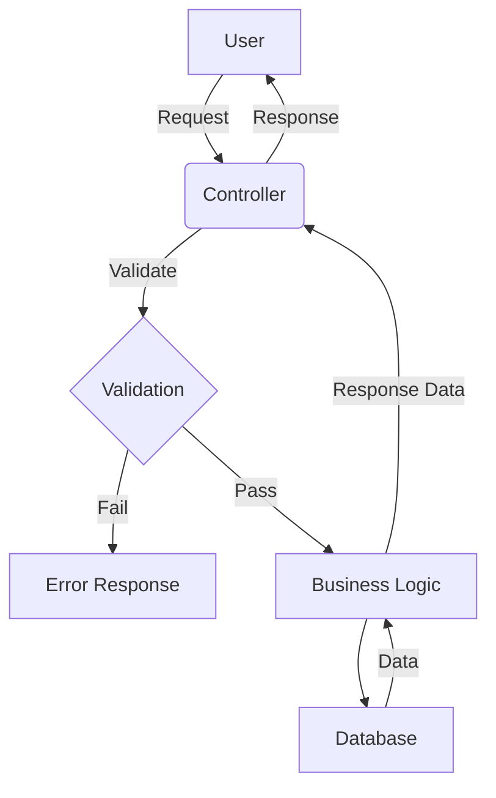

## Module: Controller.php
Based on the provided code snippet, let's analyze the `Controller` module in detail:

### Module Name
The module is named `Controller.php`.

### Primary Objectives
The primary purpose of this module is to serve as a base controller class for all other controllers in a Laravel application. It integrates basic functionalities such as authorization and validation, which are essential for handling HTTP requests.

### Critical Functions
This module does not explicitly define its own methods but imports and uses two critical traits:
- `AuthorizesRequests`: Facilitates authorization checks, allowing controllers to enforce permission checks on actions.
- `ValidatesRequests`: Provides convenient methods for validating incoming HTTP request data.

### Key Variables
There are no explicit key variables defined within this module. However, the use of traits implies that any controller extending this base controller can leverage the methods and properties provided by the `AuthorizesRequests` and `ValidatesRequests` traits.

### Interdependencies
This module depends on several Laravel components:
- `Illuminate\Foundation\Auth\Access\AuthorizesRequests`: A trait provided by Laravel for handling authorization.
- `Illuminate\Foundation\Validation\ValidatesRequests`: A trait for handling validation of HTTP requests.
- `Illuminate\Routing\Controller as BaseController`: The core Laravel controller class that this custom `Controller` class extends.

### Core vs. Auxiliary Operations
- **Core Operations**: The core functionality of this module revolves around providing a foundation for authorization and validation in child controllers.
- **Auxiliary Operations**: While the module itself does not define auxiliary operations, the included traits (`AuthorizesRequests`, `ValidatesRequests`) offer auxiliary methods that can be used by extending controllers for specific tasks related to authorization and validation.

### Operational Sequence
There isn't a distinct operational sequence defined within this module itself, as it primarily sets up a base for other controllers. The operational flow would depend on how the extending controllers implement and utilize the provided authorization and validation capabilities.

### Performance Aspects
Performance considerations for this module are minimal since it acts as a foundational class. However, the efficiency of the authorization and validation processes would depend on how the methods provided by the included traits are used in child controllers.

### Reusability
This module is highly reusable, as it is designed to be the base class for all controllers within the application. Its generic nature allows for any specific controller to extend its functionality without the need to duplicate authorization and validation code.

### Usage
In a Laravel application, any custom controller should extend this `Controller` class to inherit authorization and validation capabilities. For example:
```php
class MyController extends Controller {
    // Custom methods here
}
```

### Assumptions
- The application is built using the Laravel framework, which provides the traits and base controller class being extended.
- Developers extending this base controller understand how to utilize Laravel's authorization and validation features.
- There is an assumption that all controllers within the application require some form of request validation and authorization checks, which justifies their inclusion in the base controller.
## Flow Diagram [via mermaid]

