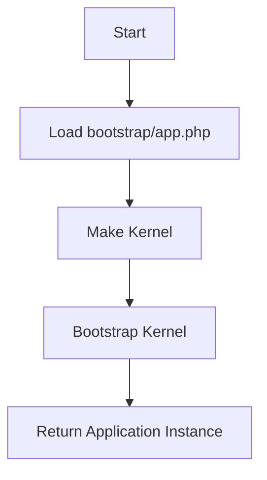

## Module: CreatesApplication.php
Given the provided code snippet, here is a comprehensive analysis:

- **Module Name**: CreatesApplication.php

- **Primary Objectives**: The primary purpose of this module is to provide a reusable way to create and bootstrap a Laravel application instance for testing environments. It is designed to be used within test classes to ensure that a properly configured instance of the Laravel application is available for each test.

- **Critical Functions**:
  - `createApplication()`: This method is responsible for bootstrapping and returning a new instance of the Laravel application. It does so by requiring the `bootstrap/app.php` file, which initializes the application, and then calls the `bootstrap` method on the application's Kernel to load the necessary configurations, environment variables, and service providers.

- **Key Variables**:
  - `$app`: This variable holds the instance of the Laravel application created by requiring the `bootstrap/app.php` file.

- **Interdependencies**:
  - `Illuminate\Contracts\Console\Kernel`: This dependency is used to access the application's Kernel, which is necessary for bootstrapping the application.
  - `Illuminate\Foundation\Application`: This is the type of object that the `createApplication` method must return, representing the Laravel application instance.

- **Core vs. Auxiliary Operations**:
  - **Core Operations**: The core operation of this module is the bootstrapping of the Laravel application, performed by the `createApplication` method.
  - **Auxiliary Operations**: There are no explicit auxiliary operations defined within this module, as its sole purpose is to bootstrap the application for testing.

- **Operational Sequence**:
  - The operational sequence involves calling the `createApplication` method, which then requires the `bootstrap/app.php` file to instantiate the Laravel application. Following this, it retrieves the Kernel from the service container and calls its `bootstrap` method to prepare the application for use.

- **Performance Aspects**:
  - While performance is generally not the primary concern in testing environments, this module efficiently bootstraps the application by directly invoking the necessary initialization steps. It avoids unnecessary overhead by not performing any operations not directly related to bootstrapping.

- **Reusability**:
  - This module is highly reusable across different testing classes within a Laravel project. By encapsulating the application bootstrapping logic within a trait, it allows any test class to use this functionality simply by using the `CreatesApplication` trait.

- **Usage**:
  - To use this module, a test class needs to use the `CreatesApplication` trait. This provides the test class with the ability to create a fresh instance of the Laravel application for each test, ensuring a clean environment for testing.

- **Assumptions**:
  - It assumes that the Laravel application's bootstrap file is located at a specific path (`__DIR__.'/../bootstrap/app.php'`), relative to the location of the test classes.
  - It assumes that the Laravel application follows the standard structure and initialization process, using a Kernel that can be bootstrapped to set up the application environment.

This analysis covers the essential aspects of the `CreatesApplication.php` module, highlighting its role in facilitating testing within Laravel applications by ensuring a standardized and clean application instance is available for each test.
## Flow Diagram [via mermaid]

