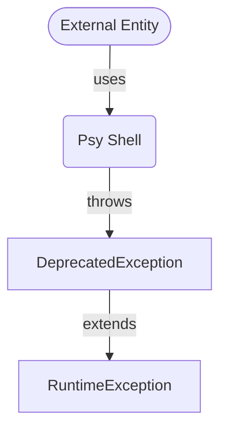

## Module: DeprecatedException.php
Given the provided code snippet for `DeprecatedException.php`, here is a comprehensive analysis:

- **Module Name**: DeprecatedException.php

- **Primary Objectives**: The primary purpose of this module is to define a custom exception type, `DeprecatedException`, which is specific to the Psy Shell application. This exception is intended to be thrown in cases where deprecated features or functionalities are invoked, allowing the application to handle these occurrences distinctly from other kinds of exceptions.

- **Critical Functions**: Since the `DeprecatedException` class extends `RuntimeException` but does not explicitly define any new methods or properties (as indicated by the comment "This space intentionally left blank"), the critical functions of this module are inherited from the `RuntimeException` class. These inherited methods include standard exception handling functionalities such as getting the message, code, file, and line where the exception was thrown, along with the stack trace and previous exception if any.

- **Key Variables**: There are no explicitly defined variables within the `DeprecatedException` class itself. Key variables would be those inherited from the `RuntimeException` or more broadly from the `Exception` class, which include properties like `$message`, `$code`, `$file`, and `$line`.

- **Interdependencies**: This module depends on the `RuntimeException` class, from which it inherits. The `RuntimeException` itself is part of PHP's SPL (Standard PHP Library) exception hierarchy. There might also be indirect dependencies on the broader Psy Shell application context, specifically on how exceptions are handled within the application.

- **Core vs. Auxiliary Operations**: The core operation of this module is to provide a mechanism for identifying and handling deprecated feature usage within the Psy Shell application. There are no auxiliary operations defined within this module, as its sole purpose is to define the `DeprecatedException` class.

- **Operational Sequence**: The operational sequence involves the `DeprecatedException` being instantiated and thrown when the Psy Shell application encounters a deprecated feature. The handling of this exception would follow the standard PHP exception handling flow, which includes try-catch blocks and possibly a global exception handler if defined.

- **Performance Aspects**: Since this module simply defines an exception class and does not perform any operations on its own, the performance impact is minimal and primarily related to the overhead of exception handling in PHP, which is generally negligible in the context of handling deprecated feature usage.

- **Reusability**: The `DeprecatedException` class is highly specific to the Psy Shell application, especially given its naming and the lack of additional functionality beyond what is inherited from `RuntimeException`. However, the concept of a custom exception for deprecated features could be adapted and reused in other applications with similar needs.

- **Usage**: This exception would be used within the Psy Shell application to signal the use of deprecated features. Developers working on the Psy Shell can throw this exception in parts of the code where deprecated functionalities are invoked, providing a clear signal to users or other developers that a feature is deprecated.

- **Assumptions**: The module assumes that there is a need to distinctly handle deprecated features within the Psy Shell application. It also assumes that users or developers of the Psy Shell are familiar with exception handling in PHP and will catch and handle this exception appropriately.

This analysis outlines the structure, purpose, and considerations related to the `DeprecatedException` module within the Psy Shell application.
## Flow Diagram [via mermaid]

