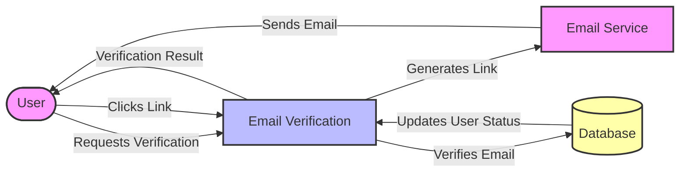

## Module: EmailVerificationTest.php
Based on the provided code snippet, here's a comprehensive analysis of the `EmailVerificationTest.php` module:

- **Module Name**: `EmailVerificationTest.php`

- **Primary Objectives**: This module is designed to test the email verification process within an application, ensuring that users can verify their email addresses correctly and handling cases where verification fails due to incorrect data.

- **Critical Functions**:
  - `test_email_can_be_verified()`: Tests the happy path where an email can be verified successfully using a valid verification URL.
  - `test_email_is_not_verified_with_invalid_hash()`: Tests the failure path where email verification fails due to an invalid hash in the verification URL.

- **Key Variables**:
  - `$user`: Represents the user whose email is being verified.
  - `$verificationUrl`: Stores the URL used for verifying the user's email.
  - `$response`: Holds the response from the verification attempt.

- **Interdependencies**:
  - `User` model: Needed to create and manipulate user data.
  - `Event` facade: Used to fake and assert that specific events are dispatched.
  - `URL` facade: Utilized to generate a temporary signed route for email verification.
  - `RouteServiceProvider`: Provides redirection paths post-verification.
  - `Verified` event: An event that is expected to be dispatched upon successful email verification.

- **Core vs. Auxiliary Operations**:
  - **Core Operations**: The actual verification of the email via `test_email_can_be_verified`, and the validation logic in `test_email_is_not_verified_with_invalid_hash`.
  - **Auxiliary Operations**: Setting up the user and verification URL, faking events, and asserting redirections and event dispatches.

- **Operational Sequence**:
  1. A user is created with an unverified email.
  2. A verification URL is generated.
  3. The system attempts to verify the email by accessing the URL.
  4. The system checks if the verification was successful and asserts the outcome.

- **Performance Aspects**:
  - The use of `RefreshDatabase` trait suggests that the database is reset for each test, ensuring test isolation but potentially impacting performance due to database migrations.

- **Reusability**:
  - This test module is highly specific to the email verification feature but can be adapted or expanded to cover similar features or more complex scenarios involving user verification.

- **Usage**:
  - This module is used during the testing phase of the development cycle to ensure that the email verification feature works as expected under various conditions.

- **Assumptions**:
  - It assumes that the `User` model and relevant routes (`verification.verify`) are correctly set up and functioning.
  - Assumes that the `Verified` event is correctly implemented and dispatched upon successful verification.
  - Assumes the presence of a configuration for a frontend URL redirection post-verification.

This analysis covers the module's purpose, its interaction with the system, and details about its operations, providing a clear overview of its role in the application's testing suite.
## Flow Diagram [via mermaid]

