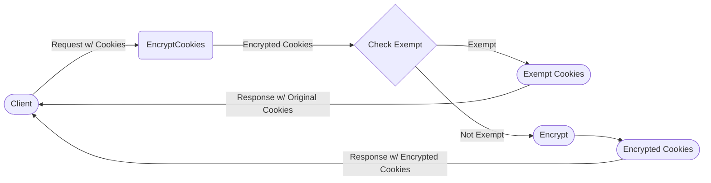

## Module: EncryptCookies.php
Given the provided code snippet, let's break down the analysis as requested:

### Module Name
The module is named `EncryptCookies.php`.

### Primary Objectives
The primary purpose of this module is to provide middleware for encrypting cookies in a Laravel application. It acts as a layer of security by ensuring that the cookie values are not stored or transferred in plain text.

### Critical Functions
While the provided code does not explicitly define functions beyond the class inheritance, we can infer its critical functions based on the Laravel framework's behavior and conventions:
- **Encryption of Cookies**: Automatically encrypts cookies before they are sent to the browser.
- **Decryption of Cookies**: Decrypts cookies upon receiving them from the browser, before they are utilized in the application.

### Key Variables
- `$except`: This is an array that contains the names of the cookies that should not be encrypted. It's crucial for excluding specific cookies from encryption, such as those that need to be read on the client-side by JavaScript.

### Interdependencies
This module extends `Illuminate\Cookie\MiddlewarencryptCookies`, which is part of Laravel's core middleware for cookie encryption. It interacts with:
- Laravel's encryption and decryption services for handling the actual encryption logic.
- The HTTP request and response handling, to intercept and modify cookie values.

### Core vs. Auxiliary Operations
- **Core Operations**: The core functionality revolves around encrypting and decrypting cookie values as they are sent and received.
- **Auxiliary Operations**: Managing the list of cookies that should not be encrypted (`$except` array).

### Operational Sequence
1. **On Request**: When a request is received, any encrypted cookies are decrypted so that the application can use their actual values.
2. **On Response**: Before sending the response to the client, all cookies (except those listed in `$except`) are encrypted.

### Performance Aspects
- **Encryption/Decryption Overhead**: Encrypting and decrypting cookies adds computational overhead, which could impact response times, especially on high-traffic sites.
- **Selective Encryption**: By excluding certain cookies from encryption (using the `$except` array), performance can be optimized by not encrypting cookies that don't need security.

### Reusability
The `EncryptCookies` middleware is highly reusable within any Laravel application requiring cookie encryption. It's designed to be extended or modified through the `$except` array to fit specific application needs.

### Usage
This middleware is typically used in Laravel applications that need to secure cookie data. It is registered in the application's middleware stack, usually in `app/Http/Kernel.php`, to ensure it's executed for every request.

### Assumptions
- **Security Needs**: It assumes that the application requires cookie encryption for security reasons.
- **Laravel Framework**: It assumes the application is built with the Laravel framework and follows its conventions for middleware.
- **Encryption Mechanism**: It relies on Laravel's built-in encryption mechanisms, assuming they are adequately configured (e.g., application key).

This analysis provides a comprehensive overview of the `EncryptCookies.php` module within the context of a Laravel application, highlighting its purpose, functionality, and considerations for use.
## Flow Diagram [via mermaid]

