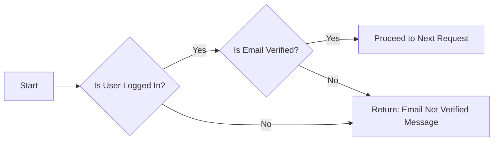

## Module: EnsureEmailIsVerified.php
Based on the provided code snippet, here's a comprehensive analysis:

- **Module Name**: EnsureEmailIsVerified

- **Primary Objectives**: This middleware aims to verify if the email address of the currently authenticated user has been verified. It's a security measure to ensure that actions or areas within the application are only accessible to users with verified email addresses.

- **Critical Functions**:
  - `handle(Request $request, Closure $next): Response`: This is the main method of the middleware. It intercepts HTTP requests and checks if the authenticated user's email address is verified before allowing the request to proceed. If the email is not verified, it returns a JSON response indicating that the email address is not verified.

- **Key Variables**:
  - `$request`: An instance of `Illuminate\Http\Request`, representing the current request.
  - `$next`: A closure that represents the next operation in the request lifecycle.

- **Interdependencies**:
  - `Illuminate\Contracts\Auth\MustVerifyEmail`: This contract is used to determine if the authenticated user's model supports email verification.
  - `Illuminate\Http\Request`: Used for retrieving the currently authenticated user.
  - `Symfony\Component\HttpFoundation\Response`: The expected response type that the `handle` method should return.

- **Core vs. Auxiliary Operations**:
  - **Core Operations**: The core operation of this module is to check if the authenticated user's email is verified (`! $request->user()->hasVerifiedEmail()`).
  - **Auxiliary Operations**: Returning a JSON response when the email is not verified can be considered an auxiliary operation, as it supports the core functionality by providing feedback to the user.

- **Operational Sequence**:
  1. Retrieve the authenticated user from the request.
  2. Check if the user exists and if their email needs to be verified.
  3. If the email is not verified, return a JSON response with an error message.
  4. If the email is verified, proceed with the next operation in the request lifecycle.

- **Performance Aspects**:
  - This middleware performs a critical security function with minimal performance overhead, as it primarily involves condition checks and potentially a database query to check the email verification status.

- **Reusability**:
  - This middleware is highly reusable in any part of the application where email verification is a prerequisite. It can be easily added to routes or groups of routes that require the user’s email to be verified.

- **Usage**:
  - Typically, this middleware is used in routes or controllers that require the user to have a verified email address. It's applied by adding it to the route middleware stack in the application's route or kernel configuration.

- **Assumptions**:
  - The user model implements the `MustVerifyEmail` contract.
  - The application uses Laravel's authentication system to manage users.
  - The middleware assumes that routes or controllers where it's applied require email verification as a precondition for access.
## Flow Diagram [via mermaid]

