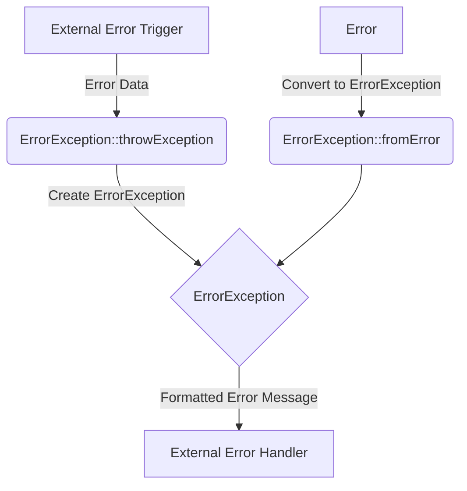

## Module: ErrorException.php
Based on the provided code snippet, here is a comprehensive analysis:

- **Module Name**: ErrorException.php

- **Primary Objectives**: This module defines a custom error exception for the Psy Shell, enhancing error handling by including formatted error messages. It extends the base PHP `ErrorException` class to provide more context-specific functionality within the Psy Shell environment.

- **Critical Functions**:
    - `__construct`: Constructor to initialize the ErrorException with a formatted message, optionally including code, severity, filename, line number, and previous throwable for comprehensive error reporting.
    - `getRawMessage`: Returns the unformatted (raw) message of the error.
    - `throwException`: Static method designed to be used as a custom error handler that throws an ErrorException.
    - `fromError`: Static method intended to create an ErrorException from a PHP Error object (marked as deprecated).

- **Key Variables**:
    - `$rawMessage`: Holds the raw, unformatted error message.

- **Interdependencies**: 
    - This module interacts with PHP's error handling mechanisms by extending the `ErrorException` class.
    - It potentially interacts with any part of the Psy Shell that handles errors or requires custom error reporting.

- **Core vs. Auxiliary Operations**:
    - Core Operations: Constructing the exception with a formatted message, and throwing the exception using `throwException`.
    - Auxiliary Operations: Retrieving the raw message using `getRawMessage`, and the deprecated `fromError` method.

- **Operational Sequence**: 
    - Typically, an error occurs within the Psy Shell.
    - The `throwException` method might be called as a custom error handler, constructing a new instance of `ErrorException` with a formatted message.
    - The constructed object can then be caught and managed by the Psy Shell's error handling system.

- **Performance Aspects**: 
    - The performance impact should be minimal, as exceptions are only created and thrown in error conditions. However, the use of regular expressions and dynamic message formatting could introduce slight overhead in error scenarios.

- **Reusability**: 
    - This module is specifically designed for the Psy Shell and its error handling mechanisms. While the approach to enhancing error messages could be adapted for use in other projects, the module itself is closely tied to the Psy Shell's architecture.

- **Usage**: 
    - Used within the Psy Shell to handle errors more gracefully by providing detailed and formatted error messages. It can be integrated into the Psy Shell's error handling setup by setting it as a custom error handler.

- **Assumptions**:
    - The module assumes that errors worthy of this exception handling will be adequately caught and managed within the Psy Shell.
    - It assumes a certain structure of error messages and that users of the Psy Shell require detailed, formatted error information for debugging.
    - The module assumes that deprecating the `fromError` method will not significantly impact existing functionality or user workflows.
## Flow Diagram [via mermaid]

