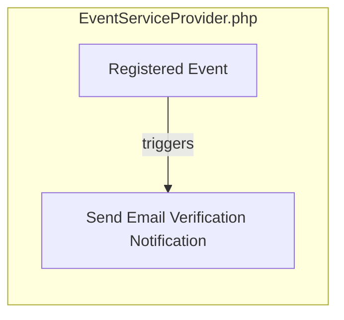

## Module: EventServiceProvider.php
Based on the provided code snippet, let's break down the analysis of the `EventServiceProvider.php` module within a Laravel application context.

- **Module Name**: `EventServiceProvider.php`

- **Primary Objectives**: This module is designed to bind events to listeners within the application. It serves as a central place to register event-listener pairs, facilitating event-driven programming in Laravel applications.

- **Critical Functions**:
  - `boot()`: This method is used to bootstrap any event listener registrations. It can be customized to manually register events and listeners, beyond what is declared in the `$listen` array.
  - `shouldDiscoverEvents()`: Determines whether Laravel should automatically discover events and listeners, as opposed to manually registering them within the `EventServiceProvider`.

- **Key Variables**:
  - `$listen`: An array mapping events to their respective listeners. This variable is crucial for defining how different parts of the application should respond to various events.

- **Interdependencies**: 
  - This module interacts closely with the Laravel event system, specifically with the `Illuminate\Authvents\Registered` event and the `Illuminate\Auth\Listeners\SendEmailVerificationNotification` listener as defined in the `$listen` array. 
  - It extends `Illuminate\Foundation\Support\ProvidersventServiceProvider`, indicating a dependency on Laravel's foundational service provider classes.

- **Core vs. Auxiliary Operations**:
  - **Core Operations**: Registering event-listener pairs within the `$listen` array and potentially customizing the event registration process within the `boot` method.
  - **Auxiliary Operations**: The `shouldDiscoverEvents` method serves as an auxiliary operation, offering additional configuration related to event discovery.

- **Operational Sequence**:
  - Upon application startup, Laravel's service provider registration process will invoke the `boot` method of this provider, where event-listener pairs defined in the `$listen` array are registered. The `shouldDiscoverEvents` method may also be called to determine if automatic event discovery should be enabled.

- **Performance Aspects**:
  - Efficient event handling is crucial for maintaining application performance. The clear mapping of events to listeners helps in optimizing response times to events. Overloading the application with unnecessary event listeners can degrade performance.

- **Reusability**:
  - The `EventServiceProvider` is highly reusable within the context of Laravel applications. It can be easily modified or extended to accommodate additional events and listeners, making it adaptable for various application needs.

- **Usage**:
  - This module is used to define how the application responds to specific events, such as user registration. For example, sending an email verification notification upon user registration is handled through the defined event-listener pair.

- **Assumptions**:
  - It assumes that events and listeners are the preferred method for handling certain operations in response to specific actions within the application.
  - It assumes that automatic event discovery is not required for the application, as `shouldDiscoverEvents` returns `false`.

This analysis provides a comprehensive overview of the `EventServiceProvider.php` module, highlighting its purpose, functionality, and integration within a Laravel application.
## Flow Diagram [via mermaid]

