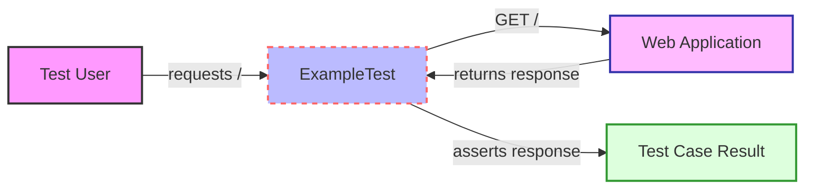

## Module: ExampleTest.php
Based on the provided code snippet, here is a comprehensive analysis:

### Module Name
The module is named `ExampleTest.php`.

### Primary Objectives
The primary purpose of this module is to serve as a unit test case, demonstrating a basic example of testing in PHP using PHPUnit. It aims to ensure that the fundamental testing infrastructure is working as expected.

### Critical Functions
- `test_that_true_is_true()`: This is the main method of the module. Its role is to assert that a true condition is indeed recognized as true by the testing framework. It's a basic sanity check to confirm that the testing setup is correctly evaluating test cases.

### Key Variables
There are no explicit key variables defined within the scope of this simple test case, as it directly uses a boolean value without assigning it to a variable.

### Interdependencies
- PHPUnit: This module depends on the PHPUnit testing framework, as indicated by the `use PHPUnit\Framework\TestCase;` statement. PHPUnit provides the foundational structure and assertions needed for writing and running this test.

### Core vs. Auxiliary Operations
- **Core Operations**: The core operation in this module is the assertion made within the `test_that_true_is_true()` method. It's the primary test that this module is designed to perform.
- **Auxiliary Operations**: There are no auxiliary operations in this module, given its simplicity and singular focus.

### Operational Sequence
The operational sequence in this module is straightforward:
1. The PHPUnit framework initializes the `ExampleTest` class.
2. The `test_that_true_is_true()` method is executed.
3. Within this method, an assertion is made that true is indeed true.

### Performance Aspects
Given the simplicity of the test (asserting true is true), performance considerations are minimal. However, in a broader context, the efficiency of tests can become crucial as the number of tests grows, necessitating considerations like test execution time and resource utilization.

### Reusability
- The module serves as a template for basic unit testing in PHP with PHPUnit. The structure can be reused and adapted for more complex tests, making it valuable as a starting point for developers unfamiliar with testing in this environment.

### Usage
This module is used as a part of a test suite in PHP development. It would be executed alongside other tests, typically via a command-line interface or through an integrated development environment (IDE) that supports PHPUnit tests. Its primary use is to verify that the testing framework and environment are correctly set up.

### Assumptions
- The module assumes that PHPUnit is correctly installed and configured in the development environment.
- It assumes that the reader understands the purpose of unit testing and the basic functionality of PHPUnit.

This analysis provides a foundational understanding of the `ExampleTest.php` module, emphasizing its role in testing, critical functions, and operational details within a PHP development context.
## Flow Diagram [via mermaid]
```mermaid
flowchart TB
    ExampleTest -->|calls| test_that_true_is_true
    test_that_true_is_true -->|asserts| assertTrue[assertTrue(true)]
    assertTrue -->|returns to| test_that_true_is_true
    test_that_true_is_true -->|completes| ExampleTest
```
## Module: ExampleTest.php
Based on the provided PHP code snippet, let's analyze the module as requested:

### Module Name
- **ExampleTest.php**

### Primary Objectives
- The primary purpose of this module is to perform a basic feature test in a PHP application, specifically to ensure that the application's root URL (`'/'`) returns a successful HTTP response (status code 200).

### Critical Functions
- **test_the_application_returns_a_successful_response()**: This is the main method in this module. Its role is to send a GET request to the application's root URL and assert that the HTTP status code of the response is 200, indicating a successful response.

### Key Variables
- **$response**: This variable holds the server's response after a GET request is made to the application's root URL.

### Interdependencies
- This module extends `TestCase`, which is likely a part of a testing framework (e.g., PHPUnit in Laravel applications). This inheritance means it relies on the functionality provided by the `TestCase` class to perform HTTP requests and assertions.
- The commented-out `use Illuminate\Foundation\Testing\RefreshDatabase;` suggests there might be an optional dependency on database refreshing capabilities for tests, although it's not utilized in this specific test.

### Core vs. Auxiliary Operations
- **Core Operations**: The core operation is the execution of a GET request to the application's root URL and the subsequent assertion to check the HTTP status code.
- **Auxiliary Operations**: None explicitly defined in this module, but setup and teardown methods inherited from `TestCase` could be considered auxiliary, facilitating test environment preparation and cleanup.

### Operational Sequence
- When the test method is executed, it follows these steps:
  1. Initiates a GET request to the application's root URL (`'/'`).
  2. Receives a response.
  3. Asserts that the response's HTTP status is 200.

### Performance Aspects
- Performance considerations might include the response time of the GET request and the efficiency of the assertion. However, since this is a simple test, performance impact is likely minimal.

### Reusability
- The module demonstrates a basic pattern for HTTP response testing that can be adapted and reused for similar tests within the application, testing different endpoints or HTTP methods.

### Usage
- This test module is used within a testing framework/environment, possibly as part of a continuous integration pipeline or during development to ensure the application's root URL is correctly responding to GET requests.

### Assumptions
- It assumes that the application's root URL (`'/'`) should always return a 200 HTTP status code.
- The test assumes it's running in an environment where the application is accessible and that any required server or application setup has been completed.
- It also assumes that the `TestCase` class provides the necessary methods and infrastructure to perform HTTP requests and assertions.

This analysis outlines the structure, purpose, and operational details of the `ExampleTest.php` module within its testing framework and application context.
## Flow Diagram [via mermaid]

