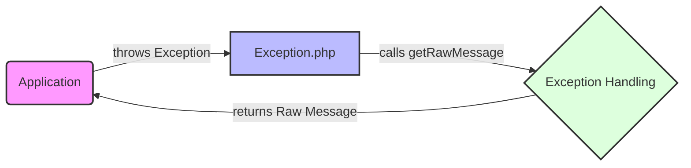

## Module: Exception.php
Based on the provided module, here's a comprehensive analysis:

- **Module Name**: The module is identified as `Exception.php`.

- **Primary Objectives**: Its purpose is to define an interface for exceptions within the Psy Shell, a runtime developer console, interactive debugger, and REPL for PHP. This interface standardizes how exceptions should behave in the Psy Shell environment, particularly in how they present their messages.

- **Critical Functions**:
  - `getRawMessage()`: The main and only method defined in this interface. Its role is to return a raw (unformatted) version of the exception message. This is crucial for maintaining a consistent interface for all exceptions in the Psy Shell, allowing other parts of the shell to handle these messages in a uniform manner.

- **Key Variables**: Not applicable in this context as the provided code defines an interface with no variable implementations.

- **Interdependencies**: This interface can interact with other system components that handle exceptions. Any class that implements the `Exception` interface will need to use this method, implying that exception handlers within the Psy Shell or applications using Psy Shell will depend on the output of `getRawMessage()` for processing or displaying error information.

- **Core vs. Auxiliary Operations**: The operation defined in this interface (`getRawMessage()`) is a core operation since it's the only method and serves the primary function of the interface—defining how exception messages are retrieved.

- **Operational Sequence**: Not applicable in this context, as the interface does not define a sequence of operations but rather a single method that implementing classes must define.

- **Performance Aspects**: Performance considerations are minimal for this interface itself but could be relevant for how the implementing classes handle the generation and retrieval of the raw message. Efficient handling and minimal processing in `getRawMessage()` would be ideal to avoid performance hits during exception handling.

- **Reusability**: The interface is highly reusable within any context that requires standardized exception handling, especially within the Psy Shell environment or any PHP project that benefits from a consistent approach to exception messages.

- **Usage**: It is used within the Psy Shell to ensure that all exceptions thrown within the shell or by shell-executed code adhere to a common interface. This allows for uniform handling, logging, or displaying of exception messages across the shell's ecosystem.

- **Assumptions**:
  - It assumes that all exceptions within the Psy Shell context can and should provide a raw, unformatted message.
  - It assumes that implementers will follow the contract and provide meaningful output for the `getRawMessage()` method.

This analysis outlines how the `Exception.php` module contributes to the Psy Shell's architecture by defining a standardized approach to handling exception messages, emphasizing simplicity and uniformity.
## Flow Diagram [via mermaid]

