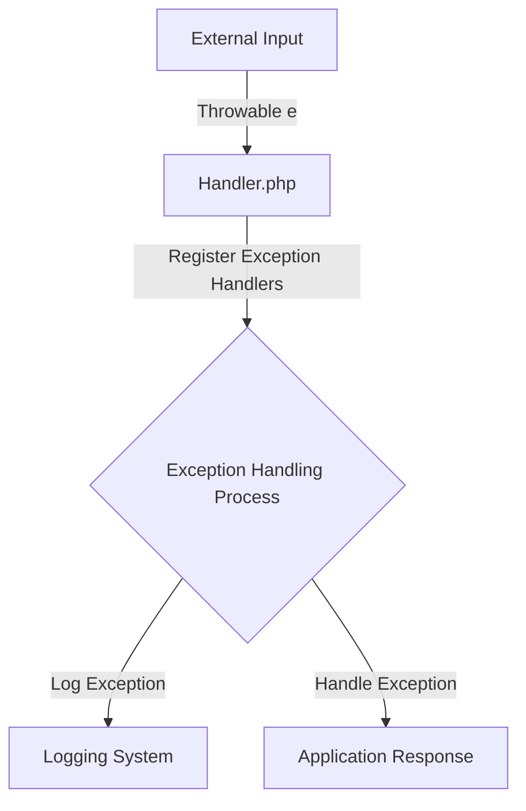

## Module: Handler.php
Based on the provided code snippet, let's break down the analysis as requested:

- **Module Name**: The module is identified as `Handler.php`.

- **Primary Objectives**: The primary purpose of this module is to handle exceptions within the application. It extends Laravel's default exception handler (`Illuminate\Foundationxceptions\Handler`) to provide a centralized exception handling mechanism for the application. This can include logging exceptions, rendering exceptions into HTTP responses, and excluding certain input fields from being flashed to the session on validation exceptions.

- **Critical Functions**:
  - `register()`: This method is used to register exception handling callbacks for the application. It allows developers to define custom responses or actions that should occur when specific types of exceptions are thrown.

- **Key Variables**:
  - `$dontFlash`: This protected array variable lists the input fields that should not be flashed to the session when a validation exception occurs. It includes sensitive information fields like `'current_password'`, `'password'`, and `'password_confirmation'`.

- **Interdependencies**: 
  - This module depends on `Illuminate\Foundationxceptions\Handler` as it extends this base exception handler provided by Laravel. It implies that it relies on the functionalities and structure defined in Laravel's core exception handling mechanism.

- **Core vs. Auxiliary Operations**:
  - **Core Operations**: The core functionality of this module is to handle exceptions by extending Laravel's exception handler capabilities, particularly in managing how exceptions are reported and rendered.
  - **Auxiliary Operations**: Preventing certain sensitive input fields from being flashed to the session during validation exceptions can be considered an auxiliary operation, as it enhances user data protection but is not directly involved in the main exception handling flow.

- **Operational Sequence**: While the provided code snippet does not show a detailed operational sequence, typically, the `register()` method would be automatically called by Laravel's exception handling mechanism to register any custom exception handling callbacks defined by the developer.

- **Performance Aspects**: Performance considerations in exception handling often involve minimizing the impact of logging and processing exceptions on the application's overall performance. Efficiently handling exceptions without significantly affecting response times is crucial.

- **Reusability**: The module is designed to be reusable across different parts of the application, as it provides a centralized way to handle exceptions. Developers can extend or modify the `register` method to add custom exception handling logic as needed.

- **Usage**: This module is used within a Laravel application to customize how exceptions are handled. For example, by modifying the `$dontFlash` array, developers can ensure that specific sensitive inputs are not exposed during a session flash. The `register()` method can be used to add custom exception handling strategies.

- **Assumptions**:
  - The module assumes that it is being used within a Laravel framework environment.
  - It assumes that the developer is familiar with the basics of exception handling in Laravel.
  - It assumes that any exception handling logic added to the `register()` method will not significantly degrade application performance.

This analysis provides an overview based on the provided code snippet, focusing on its structure and purpose within a Laravel application context.
## Flow Diagram [via mermaid]

