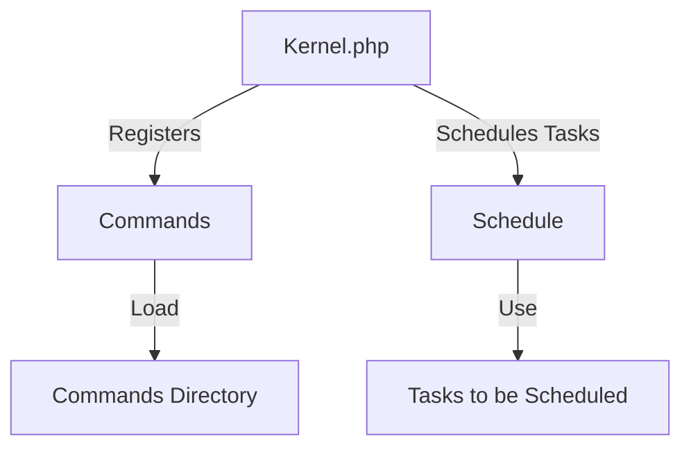
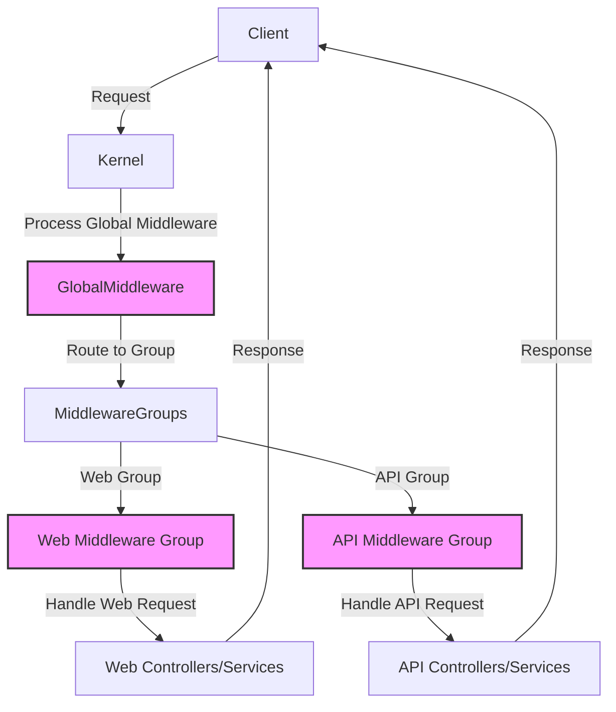

## Module: Kernel.php
Based on the provided code snippet, here's a comprehensive analysis of the `Kernel.php` module within an Laravel application:

### Module Name
The module is identified as `Kernel.php`.

### Primary Objectives
Its primary purpose is to define the core aspects of the console part of a Laravel application. This includes scheduling tasks and registering console commands.

### Critical Functions
- `schedule(Schedule $schedule)`: This method is used to define the application's command schedule. It accepts a `Schedule` object and allows the developer to define various scheduled tasks (e.g., clearing logs, sending emails) that should be executed periodically.
- `commands()`: This method is responsible for registering the console commands available within the application. It does this by loading command definitions from a specific directory and requiring a routes file for console-based routes.

### Key Variables
- `$schedule`: An instance of `Illuminate\Console\Scheduling\Schedule`, used in the `schedule` method to define scheduled tasks.

### Interdependencies
- **Laravel's Console Scheduling**: The `Schedule` object is a part of Laravel's console scheduling system, allowing tasks to be fluently defined within the `Kernel.php` module.
- **Laravel's Command Registration**: This module interacts with Laravel's command registration system by loading commands from a specified directory and a routes file.

### Core vs. Auxiliary Operations
- **Core Operations**: Registering commands and defining schedules are core operations, as they are essential for the command-line interface (CLI) aspect of the application.
- **Auxiliary Operations**: The commented-out example (`$schedule->command('inspire')->hourly();`) serves as an auxiliary operation, demonstrating how to schedule tasks but not being essential for the module's functionality.

### Operational Sequence
The operational sequence typically begins with the Laravel framework calling the `commands` method to register any custom commands followed by the `schedule` method to define scheduled tasks when the application starts or when the console kernel is invoked.

### Performance Aspects
- Efficient scheduling and command registration can significantly impact the performance, especially if scheduled tasks are resource-intensive or if a large number of commands are registered.
- Proper use of the scheduling system can help spread out resource usage over time, preventing performance spikes.

### Reusability
- The module is highly reusable within the context of Laravel applications, as it provides a structured way to define command schedules and register commands, which are common requirements across many applications.

### Usage
- This module is used by the Laravel framework automatically to handle task scheduling and command registration. Developers interact with it by modifying the `schedule` and `commands` methods to fit their application's needs.

### Assumptions
- It assumes that any commands to be scheduled or registered are properly defined elsewhere in the application (e.g., within the `Commands` directory or the `routes/console.php` file).
- It assumes that the Laravel application follows the standard directory structure and conventions for locating command definitions and scheduling tasks.

This analysis outlines the `Kernel.php` module's role in defining and managing the console aspects of a Laravel application, highlighting its flexibility, critical functionalities, and its importance in the application's ecosystem.
## Flow Diagram [via mermaid]

## Module: Kernel.php
### Module Name
The module is identified as `Kernel.php`.

### Primary Objectives
The primary purpose of this module is to configure and manage the HTTP middleware stack for a Laravel application. It serves as a central place to register global middleware, middleware groups, and route middleware, thereby controlling the HTTP request handling process.

### Critical Functions
The critical functions within this module are primarily related to the configuration arrays it defines:
- `$middleware`: Defines the global HTTP middleware stack that is run during every request to the application.
- `$middlewareGroups`: Specifies middleware groups (`web`, `api`) that bundle middleware for specific purposes or routes.
- `$middlewareAliases`: Provides aliases for middleware, allowing them to be referenced easily in routes and other parts of the application.

### Key Variables
- `$middleware`: An array of global middleware classes.
- `$middlewareGroups`: An associative array defining middleware groups with their associated middleware.
- `$middlewareAliases`: An associative array that maps middleware aliases to their class strings.

### Interdependencies
This module interacts with various components of the Laravel framework and the application:
- **Middleware Classes**: It directly depends on the middleware classes listed in its arrays. These classes are invoked according to the configurations defined in this module.
- **Laravel Framework**: As a part of the HTTP kernel, it relies on the underlying mechanisms of Laravel's request handling, including the routing and middleware pipeline.

### Core vs. Auxiliary Operations
- **Core Operations**: Registering and managing the middleware stack for handling HTTP requests.
- **Auxiliary Operations**: Providing a structure for organizing middleware into groups and aliases, which aids in the maintainability and readability of the code.

### Operational Sequence
1. A request is received by the Laravel application.
2. Global middleware defined in `$middleware` are executed in the order they are listed.
3. Depending on the route accessed, middleware groups (`web`, `api`) may be applied.
4. Route-specific middleware (referenced by aliases in `$middlewareAliases`) can be applied to individual routes.

### Performance Aspects
- Middleware execution is sequential and synchronous; thus, the order and number of middleware can impact response times.
- Efficient middleware design is crucial to avoid performance bottlenecks, especially for global middleware that runs on every request.

### Reusability
- The modular design of middleware and the Kernel's structure facilitate the reuse of middleware across different parts of the application or in different projects.
- Middleware groups and aliases further enhance reusability by simplifying the process of applying common middleware configurations.

### Usage
This module is used to configure how HTTP requests are processed in a Laravel application. It defines what middleware are applied globally, in groups, or as route-specific middleware.

### Assumptions
- The module assumes that all listed middleware classes are properly defined and available in the application's namespace.
- It assumes a Laravel framework environment where middleware is a core concept in handling HTTP requests.
- The configuration assumes that the application may have distinct needs for web and API routes, as evidenced by the separate middleware groups.
## Flow Diagram [via mermaid]

