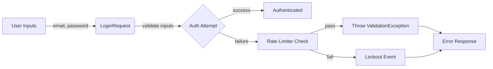

## Module: LoginRequest.php
Based on the provided PHP code for `LoginRequest.php`, here is a comprehensive analysis:

- **Module Name**: `LoginRequest`

- **Primary Objectives**: This module is designed to handle authentication requests within a Laravel application, specifically for logging in users. It validates the login request, performs authentication, and manages rate limiting to prevent brute force attacks.

- **Critical Functions**:
    - `authorize()`: Determines if the user has the authorization to make the login request.
    - `rules()`: Specifies the validation rules for the login request, such as ensuring the email and password fields are filled out correctly.
    - `authenticate()`: Attempts to authenticate the user with the provided credentials. It also manages rate limiting by calling `ensureIsNotRateLimited()` and handles authentication failures.
    - `ensureIsNotRateLimited()`: Checks if the login attempts have exceeded the rate limit and throws a `ValidationException` if so.
    - `throttleKey()`: Generates a unique key for rate limiting based on the user's email and IP address.

- **Key Variables**: The critical variables within this module are related to the user's input (`email` and `password`) and the rate limiting functionality (`throttleKey`).

- **Interdependencies**: This module interacts with several components of the Laravel framework, including:
    - `Auth`: Facade for authentication.
    - `RateLimiter`: Facade for managing rate limiting.
    - `FormRequest`: Base class for form requests in Laravel, providing validation and authorization.
    - `ValidationException`: Exception class for handling validation failures.

- **Core vs. Auxiliary Operations**:
    - **Core Operations**: Authentication (`authenticate()`), validation (`rules()`), and authorization (`authorize()`).
    - **Auxiliary Operations**: Rate limiting (`ensureIsNotRateLimited()`, `throttleKey()`).

- **Operational Sequence**:
    1. Authorization check (`authorize()`).
    2. Validation rules application (`rules()`).
    3. Rate limiting check (`ensureIsNotRateLimited()`).
    4. Attempt authentication (`authenticate()`).
    5. Handle authentication failure or success (within `authenticate()`).

- **Performance Aspects**: Performance considerations primarily revolve around the rate limiting functionality to prevent excessive resource usage due to brute force attacks. Efficient handling of authentication and validation processes also contributes to the overall performance.

- **Reusability**: The `LoginRequest` class is designed for reuse within any Laravel application that requires user authentication. Its structure and methods follow Laravel's conventions, making it adaptable for similar authentication tasks.

- **Usage**: This module is used in the authentication process, specifically when a user attempts to log in. It's bound to routes that handle login requests, ensuring that credentials are validated, and the request is authorized and not rate-limited before attempting to authenticate the user.

- **Assumptions**:
    - Users have a unique email address that can be used as a login identifier.
    - The application uses Laravel's built-in authentication and rate limiting features.
    - There is a need for rate limiting to prevent brute force attacks on user accounts.
## Flow Diagram [via mermaid]

