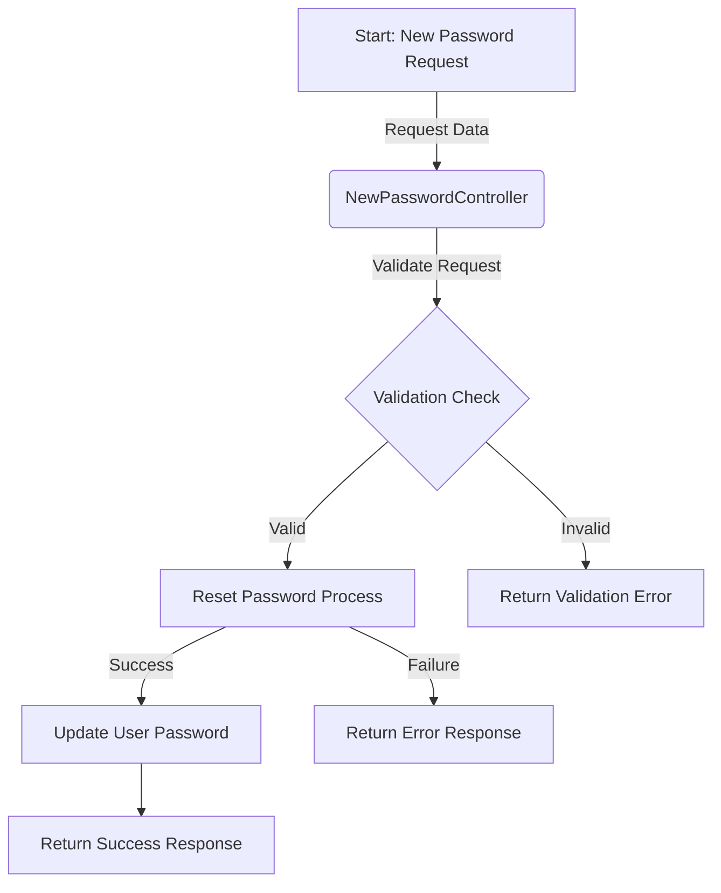

## Module: NewPasswordController.php
Based on the provided code, here's a comprehensive analysis:

- **Module Name**: NewPasswordController.php

- **Primary Objectives**: This module is designed to handle password reset requests within a Laravel application. Its main purpose is to validate the password reset request, reset the user's password, and provide a response indicating the success or failure of the operation.

- **Critical Functions**:
  - `store(Request $request)`: This is the main method of the module. It validates the incoming request, attempts to reset the user's password using the provided token, email, and new password, and returns a JSON response indicating the operation's outcome.

- **Key Variables**:
  - `$request`: An instance of `Illuminate\Http\Request` containing the password reset request data.
  - `$status`: A variable that holds the status of the password reset operation, returned by the `Password::reset` method.

- **Interdependencies**:
  - `Illuminate\Authvents\PasswordReset`: This event is dispatched when the password reset is successful.
  - `Illuminate\Support\Facades\Hash`: Used for hashing the new password before saving it to the database.
  - `Illuminate\Support\Facades\Password`: Facade used to handle the password reset logic.
  - `Illuminate\Support\Str`: Used for generating a new remember token.
  - `Illuminate\Validation\Rules`: Utilized for validating the password based on the default rules.

- **Core vs. Auxiliary Operations**:
  - **Core Operations**: Validating the request, resetting the password, and updating the user's record in the database.
  - **Auxiliary Operations**: Generating a new remember token, dispatching the `PasswordReset` event.

- **Operational Sequence**:
  1. Validate the incoming request for required fields (token, email, and password).
  2. Attempt to reset the password using the provided details.
  3. If successful, update the user's password and remember token, then save these changes.
  4. Dispatch the `PasswordReset` event.
  5. Return a JSON response indicating the operation's status.

- **Performance Aspects**: 
  - The performance of this module largely depends on the efficiency of the database operations (updating the user's password and remember token), and the underlying implementation of the `Password::reset` method. 
  - The hashing of the new password is also a critical performance aspect, as hashing algorithms are designed to be computationally intensive.

- **Reusability**:
  - This module is designed for a specific purpose (handling password resets) but follows a general Laravel controller structure, making it adaptable for similar tasks within other Laravel applications with minimal modifications.

- **Usage**:
  - This controller is used in the context of a Laravel application that requires user authentication and supports password reset functionality. It would typically be invoked through a route that handles POST requests to a specific URI (e.g., `/reset-password`).

- **Assumptions**:
  - The module assumes that the incoming request contains a valid token, email, and new password (with confirmation).
  - It is assumed that the `Password::reset` method will handle the verification of the token and the actual password reset logic.
  - The module assumes that the Laravel application is configured to use the default password reset functionality provided by the framework.

This analysis covers the primary objectives, functions, variables, and other aspects of the `NewPasswordController` module, providing a clear understanding of its role within a Laravel application's authentication system.
## Flow Diagram [via mermaid]

