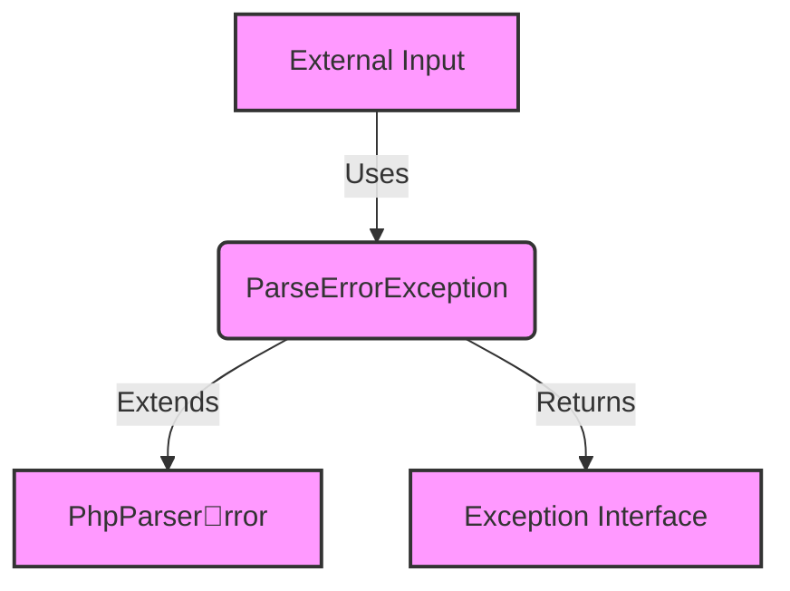

## Module: ParseErrorException.php
### Module Name
The module is identified as `ParseErrorException.php`.

### Primary Objectives
Its primary purpose is to define a custom exception type for handling parse errors within the Psy Shell, a runtime developer console, interactive debugger, and REPL for PHP. This exception specifically targets parsing errors, enhancing error handling and debugging capabilities within Psy Shell.

### Critical Functions
- **__construct**: This constructor initializes a new instance of the `ParseErrorException` with a custom message and attributes related to the parse error.
- **fromParseError**: A static method that creates a `ParseErrorException` instance from a `PhpParserrror` object, facilitating the conversion of generic PHP parser errors into a format more suitable for handling within Psy Shell.

### Key Variables
- **$message**: A string variable that holds the custom error message.
- **$attributes**: An array or integer indicating the attributes of the node/token where the error occurred or the start line of the error.

### Interdependencies
- This module extends `\PhpParserrror`, indicating a dependency on the `PhpParser` library for underlying error structures.
- It implements the `Exception` interface, aligning with PHP's exception handling system.

### Core vs. Auxiliary Operations
- **Core Operations**: The core functionality revolves around the enhanced representation and handling of parse errors (`__construct` and `fromParseError` methods).
- **Auxiliary Operations**: There are no explicit auxiliary operations defined within this module, as its focus is narrowly defined around error handling.

### Operational Sequence
1. An instance of `ParseErrorException` is created either directly through its constructor with a specific message and attributes or indirectly via the `fromParseError` method, which converts a `PhpParserrror` into a `ParseErrorException`.
2. The constructed object can then be thrown as an exception within Psy Shell to indicate a parse error.

### Performance Aspects
- Performance considerations mainly involve the overhead of exception handling. Custom exceptions like `ParseErrorException` can introduce slight performance penalties compared to normal execution flow, especially if thrown frequently.
- Efficient use of this exception type can mitigate performance concerns, limiting its use to genuine parse error scenarios.

### Reusability
- The `ParseErrorException` is designed specifically for Psy Shell and its handling of PHP parse errors. However, the pattern and implementation could be adapted for similar use cases in other projects that require custom exception handling for parsing operations.

### Usage
- This exception type is used within Psy Shell to catch and handle PHP parse errors in a more structured and informative way than generic PHP error handling would allow.
- It is likely used in conjunction with Psy Shell's parsing and evaluation of PHP code entered by the user in the console.

### Assumptions
- The module assumes that all parse errors can be adequately represented with a message and attributes (e.g., start line).
- It assumes the presence of the `PhpParserrror` class for base error structures.
- There's an underlying assumption that users of Psy Shell require detailed and specific feedback on parse errors, justifying the creation of a specialized exception type.
## Flow Diagram [via mermaid]

