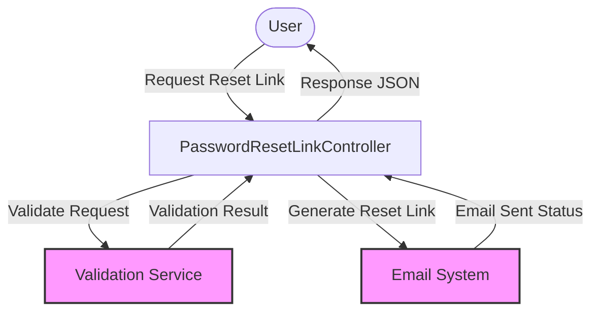

## Module: PasswordResetLinkController.php
### Module Name
The module is identified as `PasswordResetLinkController.php`.

### Primary Objectives
Its primary purpose is to handle incoming requests for password reset links, validate the request data, and send the password reset link to the user's email.

### Critical Functions
- **store(Request $request): JsonResponse** - This is the main method of the module. It validates the incoming request to ensure an email is provided, attempts to send a password reset link to the given email, and returns a JSON response with the status of the operation.

### Key Variables
- **$request** - An instance of `Illuminate\Http\Request` containing the incoming request data.
- **$status** - Holds the response status after attempting to send the password reset link.

### Interdependencies
- **Illuminate\Http\JsonResponse** and **Illuminate\Http\Request** for handling HTTP responses and requests.
- **Illuminate\Support\Facades\Password** for interacting with Laravel's password reset functionalities.
- **Illuminate\Validation\ValidationException** for handling validation exceptions.

### Core vs. Auxiliary Operations
- **Core Operations**: Validating the email address and sending the password reset link.
- **Auxiliary Operations**: Generating the JSON response and handling exceptions.

### Operational Sequence
1. The `store` method is invoked with an HTTP request.
2. The request is validated to ensure the 'email' field is present and formatted correctly.
3. Attempt to send the password reset link to the email provided.
4. If the link is successfully sent, return a success status; otherwise, throw a validation exception with the error status.

### Performance Aspects
- Performance is largely dependent on the efficiency of the email sending operation and the underlying database queries for user lookup and token generation.
- Exception handling should be efficient to not significantly impact the response time.

### Reusability
- The controller is designed for a specific purpose but can be extended or modified for similar functionalities within the application, such as other email-based notifications.

### Usage
- This module is used in the context of a web application that requires user authentication. It is specifically for the scenario where a user requests to reset their password.

### Assumptions
- The module assumes that the email provided in the request is associated with a user in the system.
- It assumes that the Laravel framework's built-in functionalities for password reset are properly configured, including email services and database connections.
- There is an assumption that the environment is set up for sending emails, and the application is correctly configured to handle localization (__ function calls for translation).

This analysis provides a comprehensive overview of the `PasswordResetLinkController.php` module, focusing on its objectives, functionalities, and operational details within a Laravel-based application.
## Flow Diagram [via mermaid]

