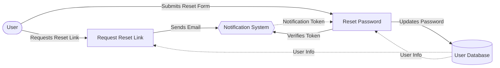

## Module: PasswordResetTest.php
Based on the provided code for `PasswordResetTest.php`, here is a comprehensive analysis:

- **Module Name**: The module is named `PasswordResetTest`.

- **Primary Objectives**: This module aims to test the functionality of the password reset process within an application. It ensures that users can request a password reset link and successfully reset their password using a valid token.

- **Critical Functions**:
    - `test_reset_password_link_can_be_requested()`: Tests if a reset password link can be requested for a user's email.
    - `test_password_can_be_reset_with_valid_token()`: Tests if a password can be successfully reset using a valid reset token.

- **Key Variables**:
    - `$user`: Represents a user instance created for the purpose of testing.
    - `Notification::fake()`: A facade to fake notification sending, crucial for intercepting and asserting the sending of reset password notifications without actually sending emails.

- **Interdependencies**:
    - `User`: The `User` model is crucial for creating user instances to test the password reset functionality.
    - `Notification`: The `Notification` facade is used to fake and assert notifications.
    - `ResetPassword`: The notification class that represents the reset password notification.
    - `RefreshDatabase`: This trait is used to refresh the database state for each test, ensuring a clean state.

- **Core vs. Auxiliary Operations**:
    - **Core Operations**: Requesting a password reset link and resetting the password using a valid token are core functionalities being tested.
    - **Auxiliary Operations**: Faking notifications and asserting their sending are auxiliary, supporting the testing of core functionalities.

- **Operational Sequence**:
    1. A user instance is created.
    2. A password reset link request is simulated.
    3. The sending of the reset password notification is asserted.
    4. For resetting the password, a valid token obtained from the notification is used along with new password credentials to simulate a password reset request.
    5. The absence of session errors is asserted to confirm a successful password reset.

- **Performance Aspects**: The use of `RefreshDatabase` ensures a clean database state, which is crucial for performance and accuracy in tests. However, extensive use in a large test suite could impact performance due to repeated database migrations.

- **Reusability**: This module is designed specifically for testing password reset functionality but can be adapted or extended for similar authentication or notification-related tests in other applications.

- **Usage**: This module is used during the development process to ensure the password reset feature works as expected. It can be part of a CI/CD pipeline to automate testing.

- **Assumptions**:
    - The user model and its factory exist and function as expected.
    - The application is set up to handle the routes (`/forgot-password` and `/reset-password`) and processes being tested.
    - Email notifications for password reset are correctly implemented using the `ResetPassword` notification class.

This analysis covers the structure, functionality, and considerations of the `PasswordResetTest` module within the context of automated testing for password reset features.
## Flow Diagram [via mermaid]

