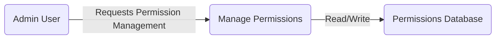
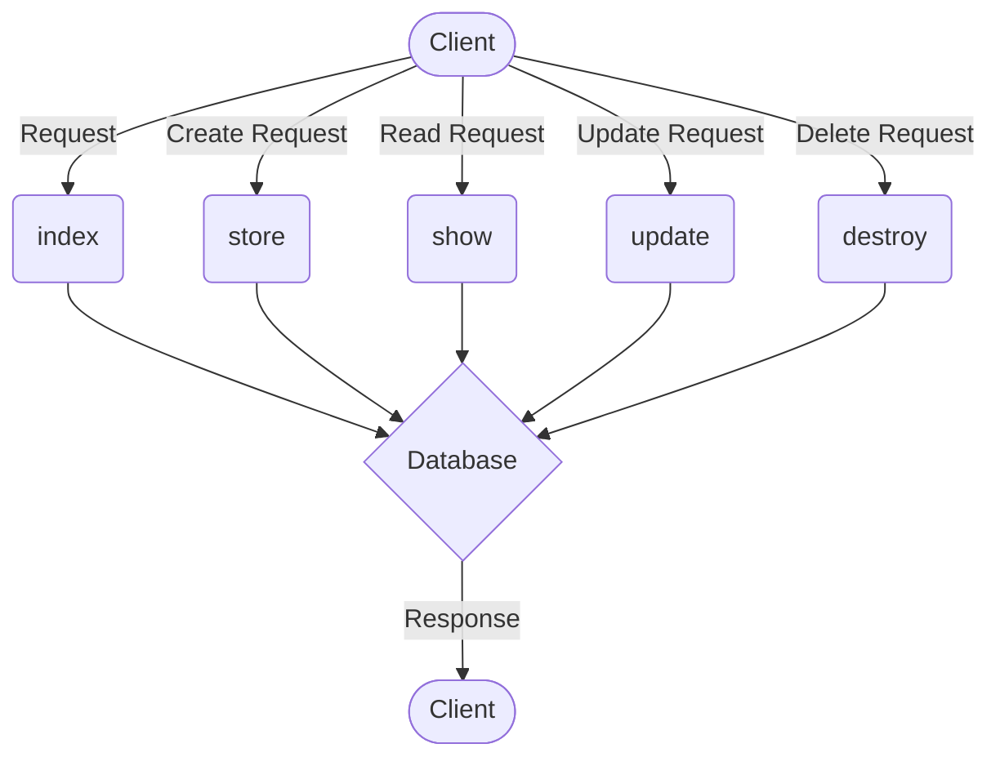

## Module: Permission.php
Given the provided code snippet for the `Permission.php` module, let's break down its components and characteristics.

### Module Name
The module is named `Permission`.

### Primary Objectives
This module is designed to extend the functionality of the `Spatie\Permission\Models\Permission` class provided by the Spatie Laravel Permission package. Its primary purpose is to manage permission entities within a Laravel application, facilitating the assignment of permissions to users or roles.

### Critical Functions
Since the provided code does not explicitly define new methods, the critical functions of this module inherit from the `Spatie\Permission\Models\Permission` class. These would typically include:
- `create()`: To create new permissions.
- `findByName()`: To find a permission by its name.
- `findById()`: To find a permission by its ID.
- `givePermissionTo()`: To assign the permission to a role or user.

### Key Variables
There are no explicit custom variables defined in the provided module. It relies on variables and properties defined in the parent `SpatiePermission` class, such as `$fillable` for mass assignable attributes or `$guard_name` for specifying the guard.

### Interdependencies
This module depends on the `Spatie\Permission\Models\Permission` class from the Spatie Laravel Permission package, indicating a reliance on the Spatie package's ecosystem for handling roles and permissions within a Laravel application.

### Core vs. Auxiliary Operations
Core operations are inherited from the parent class and involve permission management (CRUD operations, assignment, and checking). There are no auxiliary operations defined in the provided code snippet, as it primarily serves as an extension point for the Spatie Permission class.

### Operational Sequence
The operational sequence of this module would follow that of the Spatie Permission class, where permissions are created, retrieved, updated, and deleted through the model's methods. Additionally, permissions can be assigned to or removed from roles and users.

### Performance Aspects
Performance considerations would primarily revolve around database interactions for retrieving and storing permission data. Efficient indexing and querying of the permissions table can impact the performance.

### Reusability
The module is highly reusable in any Laravel application that requires role-based access control (RBAC). The extension of the Spatie Permission class allows for customization specific to the application's needs without altering the core functionality provided by the package.

### Usage
This module is used in Laravel applications for managing permissions. It can be utilized wherever there's a need to define, assign, or check permissions for roles and users, enhancing security and access control within the application.

### Assumptions
- The Laravel application uses the Spatie Laravel Permission package for role and permission management.
- The application follows the conventions of Laravel's Eloquent models for interacting with the database.
- The developer understands the basics of role-based access control (RBAC) and how it's implemented in Laravel applications using the Spatie package.
## Flow Diagram [via mermaid]

## Module: Permission.php
### Module Name
The module is named `Permission.php`.

### Primary Objectives
The primary purpose of this module is to manage permissions within an application. It is designed to handle CRUD (Create, Read, Update, Delete) operations related to permissions.

### Critical Functions
- `index()`: Displays a listing of permissions. This is typically used to retrieve and show all permissions available in the system.
- `store(Request $request)`: Stores a newly created permission in the storage. This method handles the creation of new permissions based on the request data.
- `show(string $id)`: Displays a specific permission identified by its ID. This method is used to view the details of a particular permission.
- `update(Request $request, string $id)`: Updates the specified permission in the storage. This method applies changes to an existing permission based on the request data.
- `destroy(string $id)`: Removes the specified permission from storage. This method deletes a permission from the system.

### Key Variables
- `$request`: This variable represents the HTTP request and contains data used in `store` and `update` methods for creating or modifying permissions.
- `$id`: This variable is used in `show`, `update`, and `destroy` methods to identify the specific permission to be displayed, updated, or deleted.

### Interdependencies
This module interacts with:
- The `Controller` class from which it inherits, thus relying on the Laravel framework's controller functionalities.
- The `Request` class for handling HTTP request data in the `store` and `update` methods.

### Core vs. Auxiliary Operations
- **Core Operations**: `store`, `update`, and `destroy` methods are core operations as they directly manipulate the permission resources.
- **Auxiliary Operations**: `index` and `show` methods serve auxiliary functions, providing the ability to list and view permissions without modifying them.

### Operational Sequence
Typically, the operational flow might start with `index` to list permissions, followed by `store` to add a new permission. The `show` method can be used to view details of a specific permission. The `update` method modifies an existing permission, and `destroy` removes a permission.

### Performance Aspects
Performance considerations include efficient handling of database operations in `store`, `update`, and `destroy` methods to minimize response times and resource usage. Indexing the ID field in the database can improve the performance of `show`, `update`, and `destroy` operations.

### Reusability
The module is designed with reusability in mind, following the CRUD pattern common in web applications. It can be adapted or extended for managing other types of resources beyond permissions.

### Usage
This module is used in the context of a web application requiring permission management. It provides the necessary endpoints for a frontend interface to create, list, view, update, and delete permissions.

### Assumptions
- The module assumes that permissions are stored in a database or similar storage system accessible by the application.
- It assumes that the ID uniquely identifies each permission.
- There's an implicit assumption about the existence of middleware or other mechanisms for authentication and authorization to protect these endpoints.
## Flow Diagram [via mermaid]

