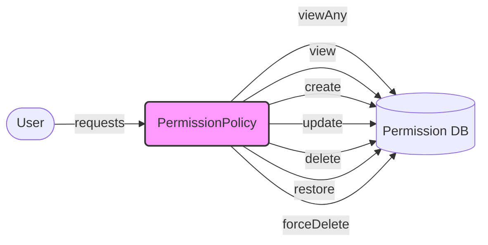

## Module: PermissionPolicy.php
Based on the provided code snippet, here is a comprehensive analysis of the module:

- **Module Name**: The module is named `PermissionPolicy`.

- **Primary Objectives**: Its primary purpose is to define authorization rules for different actions (view, create, update, delete, restore, and permanently delete) that can be performed on `Permission` models by `User` entities. It acts as a gatekeeper to ensure that only authorized users can perform specific actions on permissions.

- **Critical Functions**:
  - `viewAny(User $user): bool`: Determines if a user can view any `Permission` models.
  - `view(User $user, Permission $permission): bool`: Determines if a user can view a specific `Permission` model.
  - `create(User $user): bool`: Determines if a user can create a `Permission` model.
  - `update(User $user, Permission $permission): bool`: Determines if a user can update a specific `Permission` model.
  - `delete(User $user, Permission $permission): bool`: Determines if a user can delete a specific `Permission` model.
  - `restore(User $user, Permission $permission): bool`: Determines if a user can restore a specific `Permission` model.
  - `forceDelete(User $user, Permission $permission): bool`: Determines if a user can permanently delete a specific `Permission` model.

- **Key Variables**:
  - `User $user`: Represents the user attempting to perform an action.
  - `Permission $permission`: Represents the specific `Permission` model that the action is being attempted on.

- **Interdependencies**:
  - This module relies on the `User` and `Permission` models to check permissions. It is closely linked with the authentication and authorization mechanisms of the application, especially where permissions are checked before performing actions on `Permission` models.

- **Core vs. Auxiliary Operations**:
  - Core operations include `view`, `create`, `update`, and `delete` as these are fundamental actions for managing `Permission` models.
  - Auxiliary operations could be considered `restore` and `forceDelete` as they deal with edge cases of permission management (e.g., dealing with soft-deleted models).

- **Operational Sequence**:
  - Typically, the operational sequence begins with authentication (ensuring a user is logged in) and then proceeds to authorization (using these policies to check if the authenticated user has permission to perform the desired action).

- **Performance Aspects**:
  - Performance considerations might include ensuring efficient database queries when checking permissions, especially for operations that might be called frequently or in bulk operations.

- **Reusability**:
  - This policy module is designed for reuse across the application wherever `Permission` model actions are performed. It centralizes the logic for permission checks, making the application more maintainable and the authorization rules easier to update.

- **Usage**:
  - It is used in conjunction with Laravel's authorization system, typically by calling these methods before performing the associated actions in controllers or other parts of the application. It ensures that only authorized users can perform specific actions, enhancing security.

- **Assumptions**:
  - The module assumes that the `User` and `Permission` models exist and are correctly set up in the application.
  - It assumes that there is a clear definition of what each action (view, create, update, delete, restore, forceDelete) means in the context of `Permission` models.
  - It assumes that the application has a mechanism for authenticating users and identifying the currently logged-in user.
## Flow Diagram [via mermaid]

