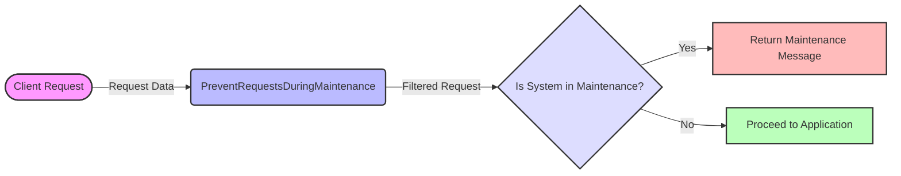

## Module: PreventRequestsDuringMaintenance.php
Based on the provided code snippet, here's a comprehensive analysis of the module:

### Module Name
PreventRequestsDuringMaintenance.php

### Primary Objectives
The primary purpose of this module is to intercept HTTP requests to the application and prevent access to the application's functionalities during maintenance mode, except for specified URIs that are allowed to be accessible.

### Critical Functions
- **Constructor**: Inherits the constructor from the parent Middleware class. It initializes the middleware with any necessary setup.
- **$except Array**: This is not a function but a critical component that lists URIs exempted from the maintenance mode block.

### Key Variables
- **$except**: This protected array variable holds the list of URIs that should remain accessible even when the application is in maintenance mode.

### Interdependencies
- **Inherits from `Illuminate\Foundation\Http\Middleware\PreventRequestsDuringMaintenance`**: This module extends Laravel's built-in middleware for handling maintenance mode, leveraging the framework's functionality for determining when to block requests and when to allow them through based on the `$except` array.

### Core vs. Auxiliary Operations
- **Core Operations**: The core functionality of this module revolves around checking incoming requests against the `$except` list and deciding whether to allow the request to proceed or to block it due to maintenance mode.
- **Auxiliary Operations**: There are no explicit auxiliary operations defined within this module, as its sole purpose is tightly focused on handling requests during maintenance.

### Operational Sequence
1. An HTTP request is received by the application.
2. The middleware checks if the application is in maintenance mode.
3. If in maintenance mode, the middleware then checks if the request's URI matches any in the `$except` list.
4. If a match is found, the request is allowed to proceed; otherwise, it is blocked.

### Performance Aspects
This middleware operates on every request when active, which could introduce a minimal performance overhead. However, since the operations involved are relatively lightweight (checking an array for a match), the impact should be negligible on the application's overall performance.

### Reusability
The module is highly reusable in its current form or with modifications. The `$except` array can be easily adjusted to fit the needs of different applications or different maintenance scenarios.

### Usage
This middleware is used by registering it with the application's HTTP kernel or including it in route/middleware groups. It's particularly useful for applications that require certain endpoints (like API health checks or user login pages) to remain accessible during maintenance periods.

### Assumptions
- The application is using Laravel or a Laravel-based framework, given the inheritance from `Illuminate\Foundation\Http\Middleware`.
- Maintenance mode is managed by the application and can be toggled on or off.
- The developer is responsible for populating the `$except` array with the URIs that need to remain accessible during maintenance.

This analysis outlines the module's design, purpose, and functionality within an application's middleware stack, emphasizing its role in managing access during maintenance periods.
## Flow Diagram [via mermaid]

