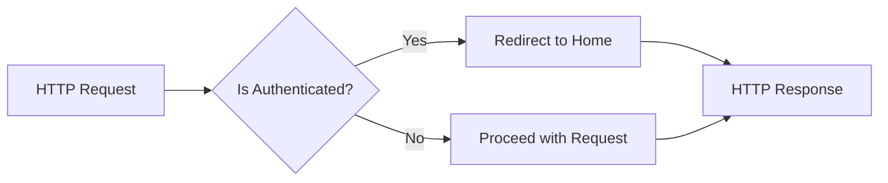

## Module: RedirectIfAuthenticated.php
Based on the provided code module, here is a comprehensive analysis:

- **Module Name**: The module is named `RedirectIfAuthenticated`.

- **Primary Objectives**: Its primary purpose is to intercept HTTP requests within the application and redirect users who are already authenticated to a predefined home page, preventing them from accessing certain routes intended only for guest users.

- **Critical Functions**:
  - `handle(Request $request, Closure $next, string ...$guards)`: This is the main method of the middleware. It checks if the current user is authenticated within any given guard(s). If authenticated, it redirects the user to a predefined route; otherwise, it allows the request to proceed to the next middleware or the intended route.

- **Key Variables**:
  - `$guards`: An array of authentication guards to check against. It determines which guard should be used to authenticate the user.
  - `RouteServiceProvider::HOME`: A constant that defines the route to which authenticated users are redirected.

- **Interdependencies**:
  - `Illuminate\Support\Facades\Auth`: This facade is used for authentication checks.
  - `App\Providers\RouteServiceProvider`: This provider is used to get the route to redirect authenticated users.
  - `Symfony\Component\HttpFoundation\Response`: The method `handle` returns an instance of this class, indicating how HTTP responses are managed and returned.

- **Core vs. Auxiliary Operations**:
  - **Core Operations**: The core operation of this module is the authentication check and subsequent redirection using `Auth::guard($guard)->check()` and `redirect(RouteServiceProvider::HOME)`.
  - **Auxiliary Operations**: Parsing the `$guards` parameter to determine which guard(s) to use for the authentication check can be considered an auxiliary operation, supporting the main redirect functionality.

- **Operational Sequence**:
  - The operational flow starts with receiving an HTTP request.
  - It then checks if any guards are specified; if not, it defaults to using the primary guard.
  - For each specified guard, it checks if the user is authenticated.
  - If the user is authenticated under any of the guards, it redirects them to the home route.
  - If not authenticated, it allows the request to proceed to the next middleware or the final route.

- **Performance Aspects**:
  - Performance considerations include efficiently checking user authentication status, especially under multiple guards. Optimizing guard checks and redirection logic is crucial for maintaining fast response times.

- **Reusability**:
  - This middleware is highly reusable across different applications requiring authenticated user redirection. It is adaptable through the `$guards` parameter, allowing it to work with various authentication systems.

- **Usage**:
  - It is used in web applications to prevent authenticated users from accessing routes intended for guests, such as login or registration pages, by redirecting them to a home or dashboard page.

- **Assumptions**:
  - It assumes that the application uses Laravel's authentication system and that the `Auth` facade is properly configured.
  - It assumes that there is a defined route named as specified in `RouteServiceProvider::HOME` to which authenticated users can be redirected.
  - It assumes that the application might use multiple guards for authentication, and handling them correctly is necessary for the middleware to function as intended.
## Flow Diagram [via mermaid]

