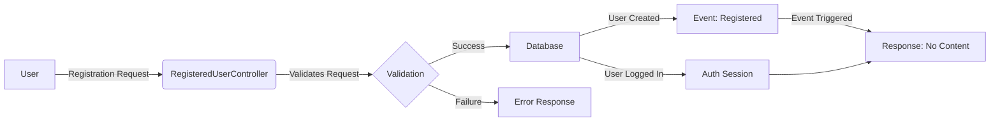

## Module: RegisteredUserController.php
### Module Name
RegisteredUserController.php

### Primary Objectives
This module is designed to handle user registration within a web application. Its primary objective is to facilitate the creation of new user accounts by validating input data, creating a new user record in the database, and automatically logging in the newly registered user.

### Critical Functions
- **store(Request $request): Response** - This is the key method of the module. It validates the registration request data, creates a new user in the database using the provided details, triggers a registration event, logs in the newly created user, and finally returns an HTTP response indicating that the process has been completed without content.

### Key Variables
- **$request** - An instance of `Illuminate\Http\Request` that contains the HTTP request data.
- **$user** - Represents the newly created user instance after successful registration.

### Interdependencies
- **User Model** - Relies on the `App\Models\User` model for creating new user records in the database.
- **Auth** - Utilizes `Illuminate\Support\Facades\Auth` for logging in the newly created user.
- **Hash** - Uses `Illuminate\Support\Facades\Hash` for hashing the user's password before storing it in the database.
- **Registered Event** - Dispatches the `Illuminate\Authvents\Registered` event after a new user is successfully created.

### Core vs. Auxiliary Operations
- **Core Operations**: Validating input data, creating a new user record, and logging in the user.
- **Auxiliary Operations**: Triggering the `Registered` event.

### Operational Sequence
1. Validate the incoming request data.
2. Create a new user in the database with the validated data.
3. Hash the user's password for secure storage.
4. Dispatch the `Registered` event for the newly created user.
5. Log in the newly created user.
6. Return an HTTP response to indicate successful registration.

### Performance Aspects
- The method efficiently handles user registration by performing essential operations such as data validation, password hashing, and user creation in a sequential manner. However, the performance could be affected by the complexity of the password hashing algorithm and the database's response time during the user creation process.

### Reusability
- The module is designed with reusability in mind, as it encapsulates the user registration logic within a single method, making it easy to modify or extend without affecting other parts of the application.

### Usage
This module is used in the context of user registration within a web application. It is typically invoked when a new user submits a registration form with their name, email, and password.

### Assumptions
- The module assumes that the incoming request data includes a `name`, `email`, and `password`, along with a password confirmation.
- It assumes that the `User` model is correctly set up for creating new records in the database.
- The module presumes that the application is configured to dispatch events and handle authentication via the Auth facade.
## Flow Diagram [via mermaid]

