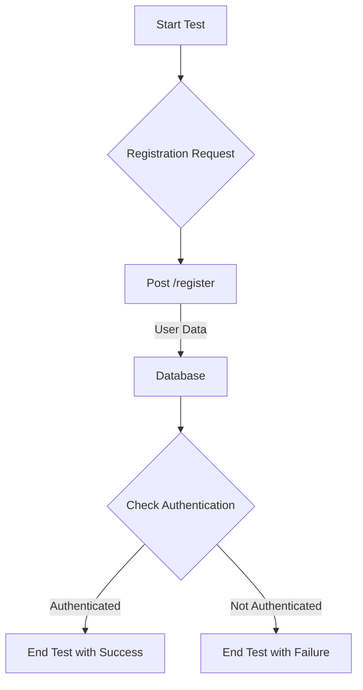

## Module: RegistrationTest.php
### Module Name
The module is identified as `RegistrationTest.php`.

### Primary Objectives
Its primary purpose is to test the user registration process within an application, ensuring that new users can successfully register.

### Critical Functions
- `test_new_users_can_register()`: This method tests the registration process by sending a POST request with user credentials and asserts that the user is authenticated afterwards.

### Key Variables
- `$response`: Holds the server's response after a POST request is made to the registration route.
- User credentials such as `name`, `email`, `password`, and `password_confirmation`.

### Interdependencies
- **Laravel's Testing Framework**: The module heavily relies on Laravel's testing capabilities, particularly the `TestCase` class and the `RefreshDatabase` trait.
- **Authentication System**: It interacts with the application's authentication system to verify that a user can be authenticated after registration.

### Core vs. Auxiliary Operations
- **Core Operations**: The core operation is the actual testing of the user registration process (`test_new_users_can_register()`).
- **Auxiliary Operations**: Setting up the testing environment and refreshing the database after each test to maintain isolation are auxiliary.

### Operational Sequence
1. A POST request is made to the `/register` route with predefined user credentials.
2. The system checks if the user is authenticated.
3. The response is validated to ensure no content error (indicating success).

### Performance Aspects
- The use of `RefreshDatabase` might impact performance due to the database being refreshed after each test. However, it ensures test isolation and integrity.

### Reusability
- The testing approach and methods used in this module can be adapted and reused for other feature tests within the application, especially those related to user authentication and registration.

### Usage
This module is used during the development process to automatically test the user registration functionality, ensuring that any changes to the registration process do not break existing functionality.

### Assumptions
- The application has a working authentication system.
- A `/register` route exists and is configured to handle registration requests.
- The database is configured correctly and can be refreshed without issues.
- The environment is set up for testing, including any necessary configuration for sending POST requests and handling responses.
## Flow Diagram [via mermaid]

