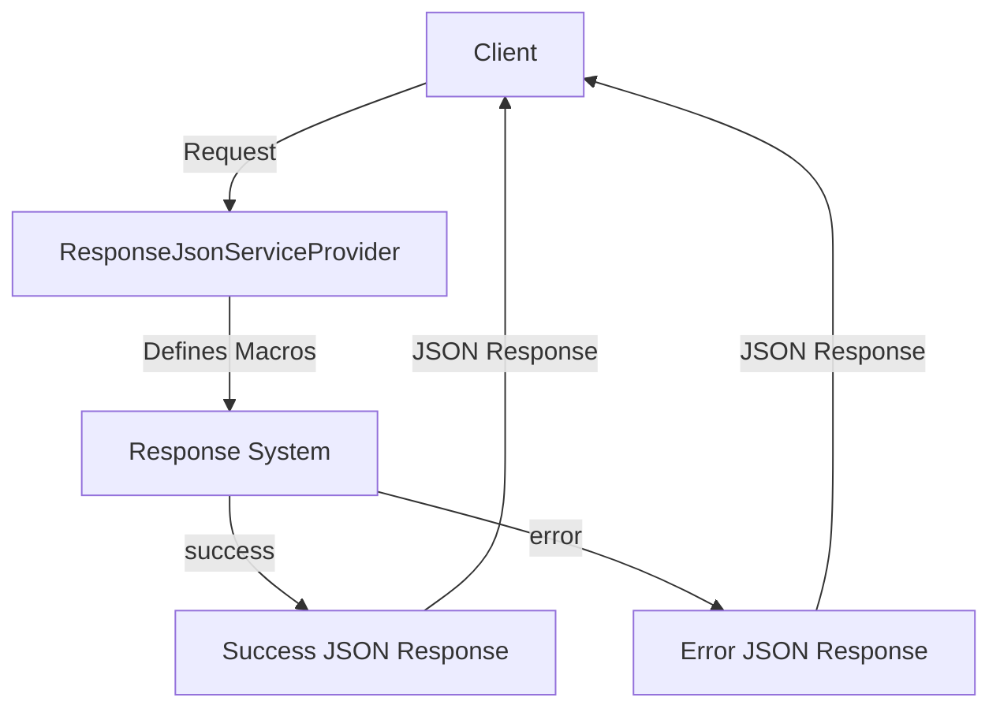

## Module: ResponseJsonServiceProvider.php
Based on the provided code for `ResponseJsonServiceProvider.php`, here is a comprehensive analysis:

- **Module Name**: ResponseJsonServiceProvider

- **Primary Objectives**: The primary purpose of this module is to extend Laravel's response functionalities by providing a standardized JSON response structure for successful and error scenarios within the application. It aims to streamline how responses are generated and ensure consistency across the application's API responses.

- **Critical Functions**:
    - `success`: This method is designed to generate a standardized JSON response for successful operations. It optionally accepts data to be included in the response. The response structure includes an `error` flag set to `false` and a `data` field containing the provided data.
    - `error`: This method generates a standardized JSON response for error scenarios. It accepts an error message and an HTTP status code, defaulting to a generic error message and a 400 status code if not provided. The response structure includes an `errors` flag set to `true` and a `message` field containing the error message.

- **Key Variables**: 
    - `$data`: Used in the `success` method to hold the data that will be returned in the response.
    - `$message`, `$status`: Used in the `error` method to customize the error message and HTTP status code of the response.

- **Interdependencies**:
    - This module extends `RouteServiceProvider` from Laravel's foundation support, indicating it relies on Laravel's service provider and routing system.
    - It heavily depends on `Illuminate\Support\Facades\Response` for generating JSON responses, showcasing its integration with Laravel's response handling mechanisms.

- **Core vs. Auxiliary Operations**:
    - **Core Operations**: The creation of the `success` and `error` response macros are the core functionalities of this module, as they directly fulfill its primary objective.
    - **Auxiliary Operations**: While not explicitly defined in the provided code, any setup or configuration code within the `boot` method that does not directly contribute to defining the response macros could be considered auxiliary.

- **Operational Sequence**: Upon bootstrapping (initialization) of the application services, the `boot` method is invoked. This method then defines two macros (`success` and `error`) to the `Response` facade, making them globally available for generating JSON responses throughout the application.

- **Performance Aspects**: The module should have minimal impact on performance since it merely extends Laravel's existing response handling capabilities with predefined JSON structures. However, the use of `Response::json` with `JSON_NUMERIC_CHECK` could introduce slight overhead for large datasets due to the need to check and convert numeric strings to numbers.

- **Reusability**: The design of this module allows for high reusability across different projects that require standardized JSON API responses. Its implementation as a service provider makes it easy to integrate and use within any Laravel application.

- **Usage**: To use the defined response macros, one would simply call `Response::success($data)` for successful responses or `Response::error($message, $status)` for error responses within the application, ensuring a consistent API response structure.

- **Assumptions**:
    - The module assumes that all successful responses might not always have data to return, hence the optional `$data` parameter in the `success` method.
    - It assumes that an error response always requires a message, but not necessarily a custom HTTP status code, hence the default values in the `error` method.
    - There's an underlying assumption that the application is built with Laravel, given the use of Laravel-specific features and classes.
## Flow Diagram [via mermaid]

