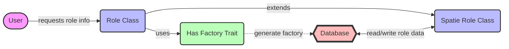

## Module: Role.php
Given the provided code snippet, let's break down the analysis as requested:

### Module Name
- **Role.php**

### Primary Objectives
- The primary purpose of this module is to extend the functionality of the `Spatie\Permission\Models\Role` model provided by the Spatie Laravel Permission package. It serves as a custom Role model for an application, leveraging the existing structure and functionalities of Spatie's Role model while allowing for future customizations specific to the application's needs.

### Critical Functions
- Given the code snippet does not explicitly define any methods, the critical functions are inherited from `Spatie\Permission\Models\Role`. Key inherited methods likely include functionalities for assigning permissions, checking role permissions, and managing role assignments to users.

### Key Variables
- **HasFactory**: This trait, used from the Laravel framework, enables the Role model to utilize factories for database seeding and testing. It's essential for generating dummy data for roles.

### Interdependencies
- The Role model depends on the `Spatie\Permission\Models\Role` for its core functionalities. It also relies on Laravel's Eloquent ORM (Object-Relational Mapping) system for database interactions and the `HasFactory` trait for database seeding and testing purposes.

### Core vs. Auxiliary Operations
- **Core Operations**: The core functionalities would include everything inherited from the Spatie Role model, such as managing roles and their permissions.
- **Auxiliary Operations**: The use of the `HasFactory` trait can be considered an auxiliary operation since it's primarily used for testing and seeding data, not the main functionality of the Role model.

### Operational Sequence
- The operational sequence is not explicitly defined in the provided snippet but would generally follow the CRUD (Create, Read, Update, Delete) operations for roles, as well as assignment and checking of permissions, as defined by the parent Spatie Role model.

### Performance Aspects
- Performance considerations would initially align with the Spatie Permission package's efficiency. Custom methods added to this Role model could impact performance, depending on their complexity and how they interact with the database.

### Reusability
- This Role model is designed to be reusable within the application it's defined in, especially since it extends a well-documented and widely used package (Spatie Permission). Its adaptability for reuse would depend on how generic or specific the customizations are.

### Usage
- This customized Role model would be used anywhere in the application where role-based permissions need to be managed. This could include assigning roles to users, checking if a user has a specific role, or modifying the permissions associated with a role.

### Assumptions
- It is assumed that the Spatie Permission package is properly installed and configured in the Laravel application.
- The application uses Laravel's Eloquent ORM for database interactions.
- There's a need for custom behavior or attributes on the Role model beyond what Spatie's default Role model provides, hence the extension.

This analysis provides a comprehensive overview based on the provided code snippet. Future developments within the module might introduce new aspects not covered here, especially regarding custom methods or properties.
## Flow Diagram [via mermaid]

