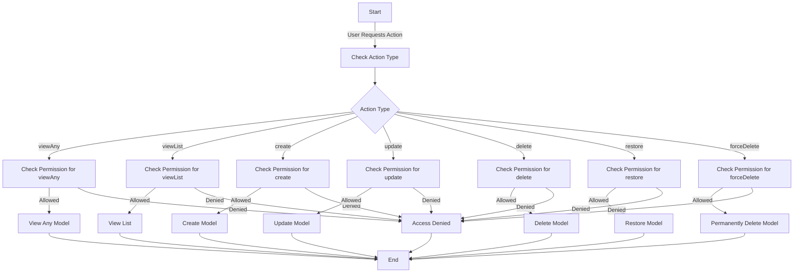

## Module: RolePolicy.php
Based on the provided code module, here is a comprehensive analysis:

- **Module Name**: The module is identified as `RolePolicy`.

- **Primary Objectives**: Its primary purpose is to define authorization rules for different actions (like viewing, creating, updating, and deleting) related to `Role` models within the application. It serves to enforce access controls based on the user's permissions.

- **Critical Functions**:
  - `viewAny(User $user)`: Determines if a user can view any instances of the `Role` model.
  - `viewList(User $user)`: Determines if a user can view a list of `Role` models.
  - `view(User $user, Role $role)`: Determines if a user can view a specific `Role` model.
  - `create(User $user)`: Determines if a user can create a new `Role` model.
  - `update(User $user, Role $role)`: Determines if a user can update a specific `Role` model.
  - `delete(User $user, Role $role)`: Determines if a user can delete a specific `Role` model.
  - `restore(User $user, Role $role)`: Determines if a user can restore a specific `Role` model.
  - `forceDelete(User $user, Role $role)`: Determines if a user can permanently delete a specific `Role` model.

- **Key Variables**:
  - `User $user`: Represents the user attempting to perform an action.
  - `Role $role`: Represents the `Role` model that the action is being attempted on.

- **Interdependencies**:
  - This module interacts with `App\Models\User` and `App\Models\Role` to check permissions and roles.
  - Utilizes traits from `Illuminate\Auth\Access`, specifically `HandlesAuthorization` for common authorization tasks.

- **Core vs. Auxiliary Operations**:
  - Core operations include methods like `view`, `create`, `update`, and `delete` that directly influence the main functionality around role management.
  - Auxiliary operations might include `viewAny` and `viewList`, which are more about viewing permissions rather than modifying data.

- **Operational Sequence**:
  - Typically, a method is called in response to an action attempt by a user (e.g., viewing or editing a role). The method then checks if the user has the required permission and returns a boolean value accordingly. There's no explicit sequence of operations within the policy itself; the sequence depends on how and when the application calls these methods.

- **Performance Aspects**:
  - Performance considerations primarily revolve around the efficiency of permission checks. Since these checks are likely to be executed frequently, ensuring they are optimized for speed is crucial, possibly caching user permissions if they are determined to be a performance bottleneck.

- **Reusability**:
  - The policy is designed with reusability in mind, as it abstracts the authorization logic for role management into a single, cohesive unit that can be easily applied across the application wherever role-related authorization is needed.

- **Usage**:
  - It is used within the application to control access to role-related actions. Before performing an action like editing or deleting a role, the application would consult this policy to ensure the user has the necessary permissions.

- **Assumptions**:
  - The module assumes that the `User` model has a method or attribute (`can`) that determines if a user has a specific permission (e.g., 'Read Role').
  - It assumes that actions not explicitly allowed are forbidden, as seen in the `viewList` method, which defaults to `false`.
  - The actual logic for some methods (`view`, `update`, `restore`, `forceDelete`) is not provided, implying an assumption that these will be implemented based on specific business logic or requirements.
## Flow Diagram [via mermaid]

