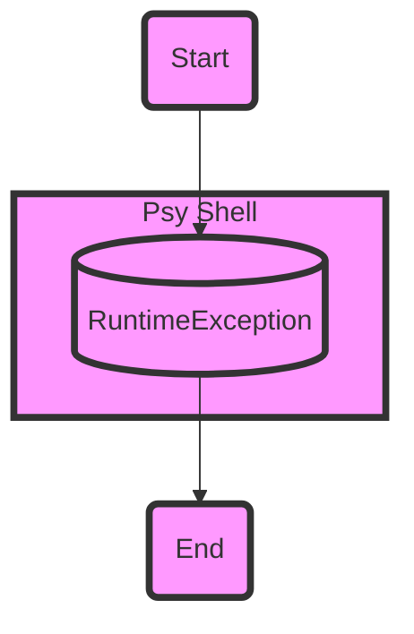

## Module: RuntimeException.php
Given the provided code snippet, let's break down the analysis as requested:

### Module Name
- **RuntimeException.php**

### Primary Objectives
- The primary purpose of this module is to define a custom exception class for the Psy Shell. This class extends the standard PHP `\RuntimeException` and is tailored to handle exceptions specific to the Psy Shell environment, providing more context or functionality relevant to its ecosystem.

### Critical Functions
- **__construct(string $message = '', int $code = 0, \Throwable $previous = null)**: This is the constructor for the `RuntimeException` class. It initializes the object with a message, an optional error code, and an optional previous throwable which caused this exception.
- **getRawMessage(): string**: This method returns the raw, unformatted message associated with the exception. This can be useful for logging or displaying an error message without any additional formatting applied by the Psy Shell or other layers.

### Key Variables
- **$rawMessage**: A private variable that holds the original, unformatted message passed to the exception. This is crucial for retrieving the exact error message without any modifications.

### Interdependencies
- This class extends PHP's built-in `\RuntimeException` and implements the `Exception` interface specific to the Psy Shell. It is tightly coupled with the exception handling mechanism of both PHP and Psy Shell.

### Core vs. Auxiliary Operations
- **Core Operations**: The creation of the exception object with a message, code, and previous throwable, and the retrieval of the raw error message.
- **Auxiliary Operations**: There might be none explicitly defined in this snippet, but auxiliary operations could include any additional methods that assist in debugging or logging the exception details, not directly related to the instantiation or basic exception handling.

### Operational Sequence
- An instance of `RuntimeException` is created, potentially with a message, code, and previous throwable. When needed, the raw message can be retrieved using `getRawMessage()`.

### Performance Aspects
- Since this is a simple extension of the standard `\RuntimeException`, performance considerations are minimal and primarily pertain to the overhead of exception handling in PHP. The storage and retrieval of an additional raw message string are negligible in terms of performance.

### Reusability
- This class is designed specifically for the Psy Shell and its exception handling mechanisms. However, the concept of extending standard exceptions to include a raw message can be adapted and reused in other projects requiring similar functionality.

### Usage
- This exception class is used within the Psy Shell to handle exceptions that occur during its operation. When an exception needs to be thrown within Psy Shell, instances of `RuntimeException` can be used to provide both a formatted message for display and a raw message for logging or further processing.

### Assumptions
- It is assumed that exceptions thrown within the Psy Shell require a raw message for certain operations, such as logging. This necessitates the existence of a custom exception class.
- It assumes familiarity with PHP's exception handling mechanisms and the structure of exceptions.

This analysis covers the essentials of the `RuntimeException.php` module within the context of Psy Shell, highlighting its purpose, functionality, and integration within a larger system.
## Flow Diagram [via mermaid]

