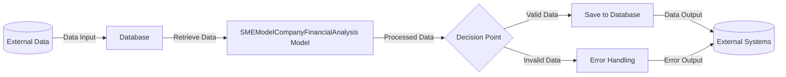

## Module: SMEModelCompanyFinancialAnalysis.php
Given the provided code snippet, I'll analyze the module as per the requested criteria.

### Module Name
The module is named `SMEModelCompanyFinancialAnalysis`.

### Primary Objectives
Its primary purpose is to serve as an Eloquent model in a Laravel application, representing the `sme_model_company_financial_analysis` table in the database. This model facilitates interactions with the database table, allowing for easy retrieval, insertion, updating, and deletion of records related to company financial analyses within a Small and Medium-sized Enterprise (SME) context.

### Critical Functions
Being an Eloquent model, the critical functions inherited from the `Model` class include:
- `find()`: To retrieve a specific record by its primary key.
- `all()`: To fetch all records from the table.
- `save()`: To save a new record or update an existing one.
- `delete()`: To remove a record from the table.

Additionally, the `HasFactory` trait suggests the use of factories for creating instances of the model, typically for testing purposes.

### Key Variables
- `$table`: Specifies the database table the model represents (`sme_model_company_financial_analysis`).
- `$guarded`: An array that prevents mass-assignment vulnerabilities for all attributes by default, allowing all attributes to be mass-assignable.

### Interdependencies
This module depends on Laravel's Eloquent ORM system for database operations and the `Illuminate\Databaseloquent\Factories\HasFactory` for model factory features. It interacts with the database configured in the Laravel application, specifically targeting the `sme_model_company_financial_analysis` table.

### Core vs. Auxiliary Operations
**Core Operations**: Interacting with the database through CRUD operations (Create, Read, Update, Delete).
**Auxiliary Operations**: Utilization of model factories for testing and seeding data into the database, facilitated by the `HasFactory` trait.

### Operational Sequence
In typical usage within a Laravel application:
1. An instance of `SMEModelCompanyFinancialAnalysis` is created or retrieved.
2. The model's properties are manipulated or populated with data.
3. The model instance is saved to the database, or other operations such as deletion are performed.

### Performance Aspects
Performance considerations include efficient database queries and the use of Laravel's Eloquent ORM features like eager loading to minimize the N+1 query problem, caching of queries, and indexing appropriate columns in the `sme_model_company_financial_analysis` table to speed up retrieval operations.

### Reusability
The model is designed for reuse across the application wherever interactions with the `sme_model_company_financial_analysis` table are necessary. Its design follows Laravel's conventions, making it easily adaptable for similar use cases or extended for more specific requirements.

### Usage
It is used within a Laravel application to interact with the `sme_model_company_financial_analysis` table. This includes fetching financial analysis data for SMEs, inserting new records after conducting a financial analysis, updating existing analyses, and deleting records as needed.

### Assumptions
- The database table `sme_model_company_financial_analysis` exists and is structured to match the expectations of the model.
- Laravel's Eloquent ORM is correctly configured to interact with the application's database.
- The model is used in a Laravel application following MVC architecture principles.
- All attributes of the `sme_model_company_financial_analysis` table are mass-assignable, as indicated by the empty `$guarded` array.
## Flow Diagram [via mermaid]

