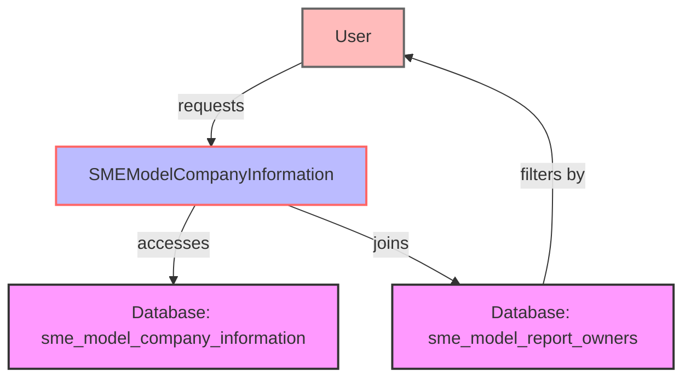

## Module: SMEModelCompanyInformation.php
Given the provided code snippet, let's break down the analysis as requested:

### Module Name
The module is named `SMEModelCompanyInformation`.

### Primary Objectives
The primary purpose of this module is to represent and manage company information within a system, specifically tailored for Small and Medium-sized Enterprises (SMEs). It acts as an ORM (Object Relational Mapping) model for the `sme_model_company_information` table in a database, facilitating the interaction between the application's code and the database.

### Critical Functions
- `scopeUserReportList($query)`: This is a query scope function that allows for the filtering of company information records associated with the currently authenticated user's reports. It joins the `sme_model_company_information` table with the `sme_model_report_owners` table based on a matching company information ID (`smci_id`) and filters records by the `user_id` of the authenticated user.

### Key Variables
- `$table`: Specifies the name of the database table (`sme_model_company_information`) that the model represents.
- `$guarded`: An array that prevents mass-assignable attributes for the model except for the `id` field.
- `$casts`: An array specifying that the `three_financial_years` field should be cast to a boolean data type when being retrieved from or stored in the database.

### Interdependencies
This module interacts with:
- The `sme_model_report_owners` table through the `scopeUserReportList` function to filter records based on the authenticated user.
- The Laravel framework's authentication system (`auth()->user()->id`) to identify the current user.

### Core vs. Auxiliary Operations
- **Core Operations**: Interacting with the database to manage company information records.
- **Auxiliary Operations**: The `scopeUserReportList` function, which extends the core functionality to provide specific data retrieval based on the user context.

### Operational Sequence
While the provided code snippet doesn't outline a complete operational sequence, it suggests that operations primarily involve retrieving and protecting company information data, with a specific focus on user-associated records.

### Performance Aspects
Performance considerations might include:
- The efficiency of the `join` operation in the `scopeUserReportList` function, especially as the dataset grows.
- The impact of using `auth()->user()->id` within a query scope, particularly regarding database query optimization and execution time.

### Reusability
The model is designed with reusability in mind, given its generic structure and the use of Eloquent's ORM features. The `scopeUserReportList` function, for example, could be reused across different parts of the application that require filtering company information by the current user.

### Usage
This model is used to interact with the `sme_model_company_information` database table. It can create, retrieve, update, and delete records relating to company information within an SME context. The specific scope method (`scopeUserReportList`) suggests it is also used to generate reports or lists of companies associated with the authenticated user.

### Assumptions
- The system assumes that each company information record can be associated with a user through the `sme_model_report_owners` table.
- It assumes the presence of an authentication system that provides a method to identify the current user (`auth()->user()->id`).
- The model assumes that casting the `three_financial_years` field to a boolean is necessary for the application's logic or data handling.
## Flow Diagram [via mermaid]

