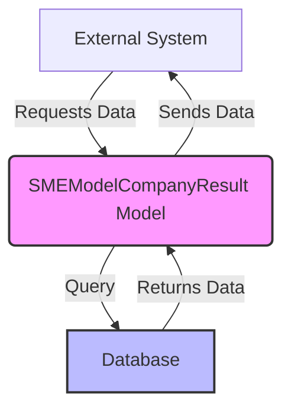

## Module: SMEModelCompanyResult.php
Based on the provided code snippet, here is a comprehensive analysis of the `SMEModelCompanyResult.php` module:

### Module Name
The module is named `SMEModelCompanyResult`.

### Primary Objectives
The primary objective of this module is to define a model in an application, likely a web application using the Laravel framework, that represents the results of some operations or evaluations related to small and medium-sized enterprises (SMEs). This model serves as a data access layer for the `sme_model_company_result` table in the database, allowing for interaction with this table's data.

### Critical Functions
- `use HasFactory;`: Enables the use of factories for database seeding and testing, simplifying the creation of test data.
  
### Key Variables
- `$table`: Specifies the name of the table in the database that the model represents (`sme_model_company_result`).
- `$guarded`: An array that Laravel uses to prevent mass-assignment vulnerabilities. An empty array means all attributes are mass-assignable.

### Interdependencies
This module depends on Laravel's Eloquent ORM system for database operations and model representation. It also relies on Laravel's `Model` and `HasFactory` traits for ORM capabilities and factory-based testing, respectively.

### Core vs. Auxiliary Operations
- **Core Operations**: Interacting with the `sme_model_company_result` database table through Eloquent's ORM features.
- **Auxiliary Operations**: Utilizing the Laravel factory feature for testing and seeding, which is more of a development convenience than a core operation of the model.

### Operational Sequence
The operational sequence is not explicitly defined in the provided code but typically follows the Laravel Eloquent model's lifecycle:
1. Model instantiation.
2. Data interaction (CRUD operations) through the model's methods.
3. Utilization of Laravel's features like mass assignment, model factories for testing and seeding.

### Performance Aspects
Performance considerations are not directly addressed in the code snippet. However, performance in models like this can be influenced by:
- The design of the underlying database table.
- The efficiency of queries executed through the model.
- The use of Laravel features such as eager loading to minimize the N+1 query problem.

### Reusability
The model is designed to be reusable within the application wherever interaction with the `sme_model_company_result` table is required. Its design follows Laravel's conventions, making it adaptable for various CRUD operations related to SME model company results.

### Usage
This model is used to interact with the `sme_model_company_result` table in the database. Typical uses include creating, reading, updating, and deleting records of company results in the context of SMEs.

### Assumptions
- The database connection is properly configured in the Laravel application.
- The `sme_model_company_result` table exists in the database with the appropriate schema.
- Laravel's ORM system is used for database interactions, implying an adherence to the Active Record pattern.
- The application follows Laravel's conventions for models, including naming and file structure.
## Flow Diagram [via mermaid]

