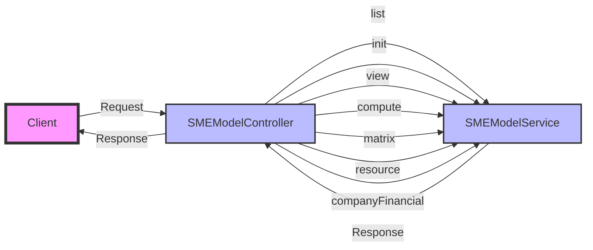

## Module: SMEModelController.php
Based on the provided code for `SMEModelController.php`, here is a comprehensive analysis:

- **Module Name**: SMEModelController.php

- **Primary Objectives**: This module is designed to serve as a controller for handling various requests related to SME (Small and Medium Enterprises) models. It interfaces between the user's HTTP requests and the service layer (`SMEModelService`), facilitating operations like listing, initializing, viewing, computing, and retrieving matrices and resources related to SME models.

- **Critical Functions**:
    - `index()`: Lists SME models based on the request parameters.
    - `init()`: Initializes an SME model with provided request data.
    - `view()`: Retrieves details of a specific SME model.
    - `compute()`: Performs computations on an SME model based on request data.
    - `matrix()`: Retrieves matrix data related to an SME model.
    - `resource()`: Fetches resources associated with an SME model.
    - `companyFinancial()`: Retrieves financial data for a company within the SME model context.

- **Key Variables**:
    - `$request`: Represents the HTTP request data.
    - `$SMEModelService`: An instance of the `SMEModelService` class, indicating dependency injection for handling the business logic.

- **Interdependencies**:
    - Relies on `SMEModelService` for the actual processing of data and business logic.
    - Depends on Laravel's request and response handling mechanisms.

- **Core vs. Auxiliary Operations**:
    - **Core Operations**: `init()`, `compute()`, `companyFinancial()` focus on the primary functionalities such as initializing models, performing calculations, and fetching financial data.
    - **Auxiliary Operations**: `index()`, `view()`, `matrix()`, `resource()` support the core operations by listing, viewing, and retrieving additional data.

- **Operational Sequence**:
    - Typically, a sequence might start with `init()` to initialize a model, followed by `compute()` to perform necessary calculations. `view()`, `matrix()`, and `resource()` can be used to retrieve specific model details, matrices, and resources, respectively. `companyFinancial()` might be used at any stage to get financial details.

- **Performance Aspects**:
    - Efficient handling of HTTP requests and responses is crucial.
    - Performance might be influenced by the complexity of operations in `SMEModelService` and the size of data being processed.

- **Reusability**:
    - The controller is designed with reusability in mind, leveraging dependency injection for service instances, making it easier to adapt or extend for similar applications.

- **Usage**:
    - This controller is used within a Laravel application, responding to HTTP requests related to SME models. It acts as a bridge between the frontend and the service layer.

- **Assumptions**:
    - Assumes `SMEModelService` provides all necessary methods (`list`, `init`, `view`, `compute`, `matrix`, `resource`, `companyFinancial`) and handles business logic efficiently.
    - Assumes proper request data is provided by the user.
    - Assumes the existence of a response helper (`response()->success`, `response()->error`) for standardizing API responses.

This analysis outlines the structure and functionality of the `SMEModelController` within a Laravel application, highlighting its role in managing SME model-related operations.
## Flow Diagram [via mermaid]

