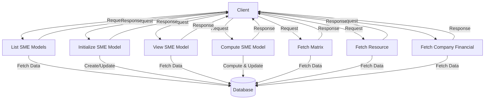

## Module: SMEModelService.php
Based on the provided code for `SMEModelService.php`, here's a comprehensive analysis:

- **Module Name**: SMEModelService
- **Primary Objectives**: The primary purpose of this module is to manage and process Small and Medium Enterprise (SME) model data, including financial and non-financial analysis, company information, and computation of results such as risk profiles and credit limits.
- **Critical Functions**:
  - `list()`: Lists SME reports based on user requests and filters.
  - `init()`: Initializes a new SME model report with basic company information.
  - `view()`: Retrieves detailed information for a specific SME model report.
  - `compute()`: Computes and updates the SME model with financial and non-financial data, generating results like risk profiles and credit limits.
  - `matrix()`: Retrieves scoring matrices for various assessment criteria.
  - `resource()`: Provides resource information such as business types and Bumiputera status.
  - `companyFinancial()`: Retrieves financial information for a company based on registration number and financial years.
- **Key Variables**:
  - `sme_model_no`: Unique identifier for the SME model.
  - `report_type`: Distinguishes between internal and external reports.
  - `paginator`: For paginating lists of SME reports.
- **Interdependencies**:
  - Interacts with multiple models representing different aspects of SME assessment, such as `SMEModelCompanyInformation`, `SMEModelCompanyFinancialAnalysis`, and others for storing and retrieving data.
  - Utilizes Laravel's `Request`, `DB`, `Auth`, `Log`, and `Carbon` for request handling, database operations, authentication, logging, and date/time operations, respectively.
- **Core vs. Auxiliary Operations**:
  - Core operations include initializing new reports (`init()`), computing results (`compute()`), and listing/viewing reports (`list()`, `view()`).
  - Auxiliary operations include retrieving matrices and resources (`matrix()`, `resource()`), which support the core functionalities but don't directly contribute to the main objectives.
- **Operational Sequence**:
  - Typically, a report is initialized (`init()`), followed by data entry for financial and non-financial analysis. The `compute()` function is then called to process this data and generate results. Viewing and listing functions are used throughout to access and manage reports.
- **Performance Aspects**:
  - The system's performance could be impacted by the complexity of computations in the `compute()` function and the efficiency of database queries, especially when handling large datasets.
- **Reusability**:
  - The modular design of the service functions and the use of models for different data aspects enhance reusability, allowing for easy adaptation and extension for similar applications.
- **Usage**:
  - Used within an application to manage SME assessments, providing users (likely internal analysts or external clients) with insights into financial health, risk profiles, and potential credit limits.
- **Assumptions**:
  - Assumes that users have the necessary permissions to access or create reports.
  - Assumes valid and well-formed input data for all operations.
  - Assumes the presence of related database tables and Laravel models for storing the SME model data.

This analysis covers the primary aspects of the `SMEModelService.php` module, highlighting its objectives, functionalities, and operational details within the context of managing SME model reports.
## Flow Diagram [via mermaid]

