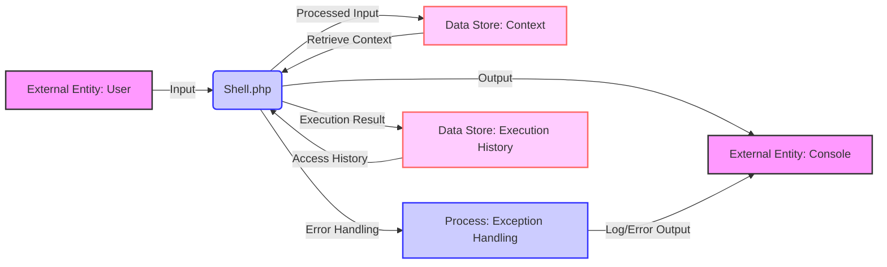

## Module: Shell.php
Given the provided module details, let's conduct a comprehensive analysis:

### Module Name
The module in question is named `Shell.php`.

### Primary Objectives
The primary purpose of this module is to serve as the Psy Shell application, an interactive shell for PHP, facilitating debugging and development tasks by providing a REPL (Read-Eval-Print Loop) environment.

### Critical Functions
- `__construct()`: Initializes the Shell instance with configuration, context, and other essential components.
- `isIncluded()`: Determines if the Psy Shell is being included via a PHP include/require statement, which helps decide whether to start a shell session or just autoload the library.
- `isPhar()`: Checks if the current PsySH executable is running from a PHAR (PHP Archive) file.

### Key Variables
- `$config`: Holds the configuration settings for the Shell instance.
- `$cleaner`: An instance of a code cleaner for sanitizing input code.
- `$context`: Manages the variables and their scope within the shell session.
- `$readline`: Handles command line input editing and history.
- `$inputBuffer`, `$codeStack`, `$stdoutBuffer`: Buffers for managing input, executed code, and output, respectively.

### Interdependencies
The module interacts with several components within the Psy Shell ecosystem and external libraries:
- `Psy\CodeCleaner`: For cleaning and validating code before execution.
- `Psyxception`: Various exception classes for error handling.
- `PsyxecutionLoop`: Handles the execution loop mechanisms.
- `Symfony\Component\Console`: Utilized for building the console application, handling input/output, and formatting.

### Core vs. Auxiliary Operations
- **Core Operations**: Running the REPL loop, executing PHP code within the shell, and managing the input/output flow.
- **Auxiliary Operations**: Configuration management, code cleaning, autocompletion, and handling of shell commands.

### Operational Sequence
1. Initialization through the constructor, setting up configuration and context.
2. Determination of execution mode (interactive shell or library autoload) based on inclusion checks.
3. Execution of the REPL loop, processing PHP code, and interacting with the user.

### Performance Aspects
Performance considerations include efficient input handling, code execution, and output display. The use of buffers and code cleaning helps in managing execution speed and memory usage.

### Reusability
The Shell module is designed to be reusable in different projects requiring an interactive PHP shell, with configurable options to tailor the shell environment.

### Usage
Typically used as a development and debugging tool, it allows developers to execute PHP code in an interactive environment, examine variables, and test code snippets on the fly.

### Assumptions
- The environment has the necessary PHP version and extensions installed.
- The user has basic knowledge of PHP and command-line interfaces.
- The module assumes it's operating in a CLI environment.

This analysis outlines the Shell module's purpose, critical functions, key variables, interdependencies, and other aspects, providing a clear understanding of its role within the Psy Shell application and its usage for PHP development and debugging tasks.
## Flow Diagram [via mermaid]

