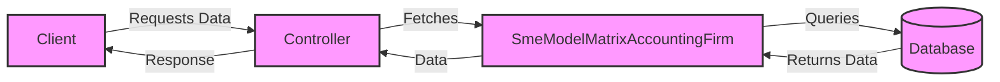

## Module: SmeModelMatrixAccountingFirm.php
Based on the provided code snippet for `SmeModelMatrixAccountingFirm.php`, let's break down the analysis as requested:

### Module Name
The module is named `SmeModelMatrixAccountingFirm`.

### Primary Objectives
Its primary purpose is to serve as an Eloquent model in a Laravel application, representing the data and interactions with the `sme_model_matrix_accounting_firm` table in the database. This model facilitates operations like querying, inserting, updating, and deleting records related to small and medium-sized enterprise (SME) model matrices within an accounting firm context.

### Critical Functions
Given the provided code, there are no custom methods explicitly defined within this model. However, by inheriting from the Laravel `Model` class and utilizing the `HasFactory` trait, it implicitly supports several critical functions:
- **Querying**: Retrieve data from the `sme_model_matrix_accounting_firm` table.
- **Inserting**: Add new records to the table.
- **Updating**: Modify existing records.
- **Deleting**: Remove records from the table.

### Key Variables
- `$table`: This protected variable explicitly specifies the database table (`sme_model_matrix_accounting_firm`) that the model represents. This is essential for the Eloquent model to perform operations on the correct table.

### Interdependencies
- **Laravel's Eloquent ORM**: This model depends on Laravel's Eloquent ORM for database interactions.
- **Database Schema**: The model assumes a specific schema in the `sme_model_matrix_accounting_firm` table but the schema details are not provided in the code snippet.

### Core vs. Auxiliary Operations
- **Core Operations**: The core operations involve CRUD (Create, Read, Update, Delete) interactions with the database table.
- **Auxiliary Operations**: Any operations related to data transformation or business logic specific to the SME model matrix would be considered auxiliary. However, such operations are not defined in the provided snippet.

### Operational Sequence
The operational sequence is not explicitly defined within this model and would typically depend on how the model is utilized within the application. The sequence of operations (CRUD) would follow standard Eloquent ORM patterns.

### Performance Aspects
Performance considerations are not directly addressed in the code snippet. However, performance can be influenced by:
- **Database Design**: Proper indexing, normalization, and schema design.
- **Query Optimization**: Efficient use of Eloquent methods to prevent N+1 problems, and optimizing complex queries.

### Reusability
The model is designed for reuse within the application wherever interactions with the `sme_model_matrix_accounting_firm` table are required. Its adherence to Laravel's conventions enhances its reusability for standard database operations.

### Usage
This model is used to interact with the `sme_model_matrix_accounting_firm` table. It can be utilized in controllers or services within the Laravel application to perform data operations related to SME model matrices in accounting firms.

### Assumptions
- The database table `sme_model_matrix_accounting_firm` exists and has a schema compatible with the operations intended by this model.
- The Laravel framework is properly set up and configured to connect to the database.
- No additional methods or properties are needed beyond what is provided by the base Model class and the HasFactory trait for the model's intended use.

This analysis covers the foundational aspects of the `SmeModelMatrixAccountingFirm` module based on the provided code snippet. Further details about specific business logic, schema, and advanced usage would require additional code and context.
## Flow Diagram [via mermaid]

