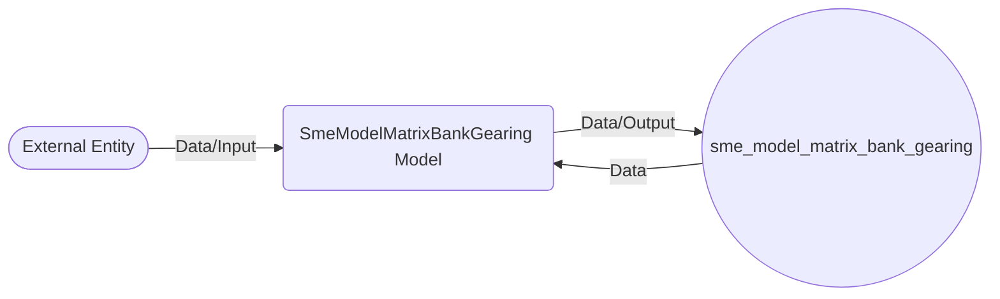

## Module: SmeModelMatrixBankGearing.php
Based on the provided code snippet, here's a comprehensive analysis:

### Module Name
The module is named `SmeModelMatrixBankGearing.php`.

### Primary Objectives
Its primary purpose is to define a model in a Laravel application that represents the data structure and functionality for handling bank gearing information related to Small and Medium-sized Enterprises (SMEs).

### Critical Functions
Given the provided code, there are no explicit custom methods within this model. However, by extending Laravel's `Model` class and utilizing the `HasFactory` trait, it inherits several critical functions for interacting with the database, such as:
- `find()`, `save()`, `delete()`: For retrieving, updating, or deleting records.
- `newQuery()`: For starting a new query builder instance.

### Key Variables
- `$table`: This variable is essential as it explicitly sets the database table that the model interacts with, which is `sme_model_matrix_bank_gearing`.

### Interdependencies
- **Laravel Framework**: It depends on Laravel's Eloquent ORM system for database operations.
- **Database**: It directly interacts with the database table named `sme_model_matrix_bank_gearing`.

### Core vs. Auxiliary Operations
- **Core Operations**: Interacting with the `sme_model_matrix_bank_gearing` table for CRUD (Create, Read, Update, Delete) operations.
- **Auxiliary Operations**: The operations provided by the `HasFactory` trait, primarily used for testing and seeding the database in a development environment.

### Operational Sequence
Not explicitly defined in the given code snippet, but typically, a model like this would be used in the sequence of querying the database, manipulating the retrieved data, and then saving any changes back to the database.

### Performance Aspects
- **Eloquent ORM**: While providing an easy and readable way to interact with the database, using an ORM can sometimes introduce performance overhead compared to raw SQL, especially with complex queries or large datasets.
- **Database Design**: The performance also heavily depends on the underlying database design, indexing, and the size of the data.

### Reusability
The model is designed with reusability in mind, adhering to Laravel's MVC architecture. It can be easily reused across the application wherever bank gearing information for SMEs is needed.

### Usage
This model would typically be used in the application to manage (create, read, update, delete) bank gearing information for SMEs. It could be utilized by controllers to present data to the user or to handle data input from user forms.

### Assumptions
- The database table `sme_model_matrix_bank_gearing` exists and is correctly structured to work with this model.
- The Laravel framework's conventions (naming, autoloading, etc.) are being followed, ensuring the model functions correctly within the application.
- The model assumes that it will primarily be used for database operations related to bank gearing for SMEs, and the structure/naming conventions reflect this focus.
## Flow Diagram [via mermaid]

