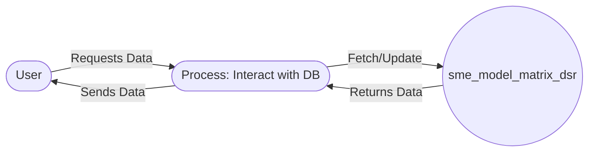

## Module: SmeModelMatrixDSR.php
Based on the provided code snippet for the `SmeModelMatrixDSR.php` module, let's break down its components and characteristics according to your requirements:

### Module Name
The module is named `SmeModelMatrixDSR`.

### Primary Objectives
The primary purpose of this module is to define a model in a Laravel application that represents the `sme_model_matrix_dsr` table in the database. It is likely used to interact with the data associated with this table, such as retrieving, creating, updating, or deleting records.

### Critical Functions
Since the provided code snippet is minimal, the main method we can identify is:
- `use HasFactory;` - This trait inclusion allows the model to utilize the Laravel factory pattern, which is primarily used for generating test data.

### Key Variables
- `$table = 'sme_model_matrix_dsr';` - This protected variable explicitly specifies the database table that the model should represent. This is critical for Laravel to know which table to query when performing operations through this model.

### Interdependencies
- The model depends on Laravel's Eloquent ORM (Object-Relational Mapping) system for database interactions and the `HasFactory` trait for factory-based data generation.

### Core vs. Auxiliary Operations
- **Core Operations**: Interacting with the `sme_model_matrix_dsr` database table (though specific methods are not detailed in this snippet).
- **Auxiliary Operations**: Utilization of the Laravel factory for generating test data.

### Operational Sequence
Not explicitly defined in the provided code snippet, as it mainly sets up the model. The operational sequence would typically involve instantiating this model and using it to perform database operations.

### Performance Aspects
Performance considerations are not directly addressed in the code snippet. However, performance can be influenced by how the model is used within the application, such as the complexity of queries and the size of the dataset.

### Reusability
The model is designed to be reusable for any operations related to the `sme_model_matrix_dsr` table. Its reusability is enhanced by the clear definition of the table it represents, making it adaptable for various CRUD operations within the application.

### Usage
This model is used within a Laravel application wherever interactions with the `sme_model_matrix_dsr` table are required. This could include creating new records, updating existing ones, retrieving data for display, or deleting records.

### Assumptions
- The code assumes that there is an existing database table named `sme_model_matrix_dsr` that this model is meant to interact with.
- It assumes the Laravel framework's conventions and functionalities, such as the Eloquent ORM system for database interactions and the availability of the `HasFactory` trait.

This analysis provides an overview based on the limited context of the provided code snippet. For a more detailed analysis, additional context about the application and how this model interacts with other components would be beneficial.
## Flow Diagram [via mermaid]

