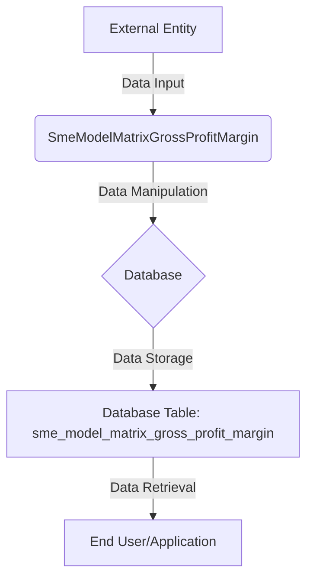

## Module: SmeModelMatrixGrossProfitMargin.php
Without the actual PHP code implementation details beyond the class definition and its properties, my analysis will be based on the provided information and general practices related to PHP and Laravel models. Here's a comprehensive analysis based on the given module name and structure:

### Module Name
The module is named `SmeModelMatrixGrossProfitMargin.php`.

### Primary Objectives
The primary purpose of this module is to represent a specific database table (`sme_model_matrix_gross_profit_margin`) within a Laravel application, specifically focusing on data related to the gross profit margin of small and medium-sized enterprises (SMEs). This model allows for easy interaction with the database table for creating, reading, updating, and deleting records related to gross profit margins.

### Critical Functions
Given the snippet, the critical functions are inherited from Laravel's `Model` class and include:
- `create()`: To insert new records into the `sme_model_matrix_gross_profit_margin` table.
- `find()`, `where()`, etc.: For retrieving records.
- `update()`: To update existing records.
- `delete()`: For removing records.

### Key Variables
- `$table`: This protected variable is essential as it explicitly defines the database table name that the model interacts with, which is `sme_model_matrix_gross_profit_margin`.

### Interdependencies
This model depends on Laravel's `Model` class and its `HasFactory` trait, indicating it can leverage Eloquent's model factories for seeding the database during development or testing.

### Core vs. Auxiliary Operations
- **Core Operations**: Interacting with the database (CRUD operations) directly related to the `sme_model_matrix_gross_profit_margin` table.
- **Auxiliary Operations**: Might include operations provided by the `HasFactory` trait for testing or seeding purposes.

### Operational Sequence
In typical usage, the operational sequence would involve:
1. Instantiating the model.
2. Performing CRUD operations through the model's methods.
3. Optionally, using the model factory for seeding data.

### Performance Aspects
Performance considerations include efficient query writing and understanding Laravel's Eloquent ORM performance implications, such as the N+1 query problem and the importance of using eager loading for related models when necessary.

### Reusability
The model is designed for reuse within any part of the Laravel application that requires interaction with the `sme_model_matrix_gross_profit_margin` table. Its methods and properties can be extended or customized for specific business logic related to gross profit margins.

### Usage
This model is used in the application wherever there is a need to interact with the `sme_model_matrix_gross_profit_margin` table. This could be in services, controllers, or even directly in views, although the latter is not recommended following MVC principles.

### Assumptions
- The database uses Laravel's Eloquent ORM.
- The table `sme_model_matrix_gross_profit_margin` exists in the database and follows a structure compatible with the operations intended by the model.
- The Laravel application is set up to follow MVC architecture, allowing this model to serve as the "M" (Model) component.

This analysis is based on standard Laravel practices and the information provided. Further details about custom methods or properties within the `SmeModelMatrixGrossProfitMargin` class would require additional code insights.
## Flow Diagram [via mermaid]

