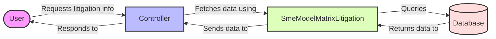

## Module: SmeModelMatrixLitigation.php
Based on the provided code snippet for the `SmeModelMatrixLitigation.php` module, here is a comprehensive analysis:

### Module Name:
The module is named `SmeModelMatrixLitigation`.

### Primary Objectives:
The primary purpose of this module is to define a model in an application, likely a web application built using the Laravel framework. This model represents a specific database table that deals with litigation-related data for Small and Medium-sized Enterprises (SMEs).

### Critical Functions:
- `use HasFactory;`: This trait inclusion allows the model to utilize the Laravel factory feature, enabling easy generation of test data.
- Model definition: The class `SmeModelMatrixLitigation` itself, by extending `Model`, inherits methods for interacting with the database (e.g., queries, inserts, updates, deletions).

### Key Variables:
- `protected $table = 'sme_model_matrix_litigation';`: This variable explicitly specifies the database table that the model represents, ensuring that all operations performed through this model are directed at the correct table.

### Interdependencies:
- Laravel's `Model` class: `SmeModelMatrixLitigation` extends Laravel's `Model` class, relying on it for core functionality.
- Laravel's `HasFactory` trait: This model uses the `HasFactory` trait for database factory support, indicating a potential dependency on factory classes for generating test data.

### Core vs. Auxiliary Operations:
- **Core Operations**: Interacting with the `sme_model_matrix_litigation` database table (CRUD operations).
- **Auxiliary Operations**: Utilizing the `HasFactory` trait for testing purposes.

### Operational Sequence:
This module, being a model, does not have an explicit operational sequence. Its methods are called as needed to interact with the database.

### Performance Aspects:
Performance considerations for this model would primarily relate to how efficiently it can handle database operations. This efficiency is influenced by underlying database design, indexes, and Laravel's ORM optimization.

### Reusability:
The model is designed for a specific table (`sme_model_matrix_litigation`) and purpose (handling litigation-related data for SMEs), which might limit its reusability in other contexts. However, the structure and patterns used can serve as a template for other models.

### Usage:
This model is used within a Laravel application to interact with the `sme_model_matrix_litigation` table. It can be used to fetch, insert, update, or delete records from this table in a structured and secure manner, adhering to the MVC pattern.

### Assumptions:
- The application is built using the Laravel framework.
- There exists a database table named `sme_model_matrix_litigation` that this model is meant to interact with.
- The table structure and fields are compatible with the operations performed by inherited methods from Laravel's `Model` class.
- The use of the `HasFactory` trait suggests that this model is also used in testing environments, implying the existence of corresponding factory classes for generating test data.
## Flow Diagram [via mermaid]

