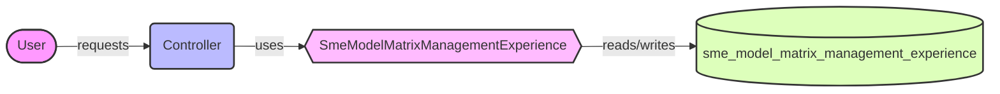

## Module: SmeModelMatrixManagementExperience.php
Given the provided code snippet, let's break down the analysis of the `SmeModelMatrixManagementExperience` module within a PHP Laravel framework context.

### Module Name
The module is named `SmeModelMatrixManagementExperience`.

### Primary Objectives
The primary purpose of this module is to serve as an Eloquent model in a Laravel application, representing the data and interactions with the `sme_model_matrix_management_experience` table in the database. It facilitates the creation, retrieval, updating, and deletion of records in this table.

### Critical Functions
Since the provided code snippet does not include specific methods beyond the Laravel model's inherent capabilities, we can infer the critical functions based on Laravel's Eloquent model features. These include:
- `save()`: Saves a new record or updates an existing one in the database.
- `find()`, `findOrFail()`: Retrieves a record by its primary key.
- `delete()`: Deletes a record from the database.
- Relationships methods (e.g., `hasOne()`, `hasMany()`, `belongsTo()`, etc.): Define relationships between this model and others.

### Key Variables
- `$table`: This protected variable explicitly sets the database table name associated with the model to `sme_model_matrix_management_experience`.

### Interdependencies
This module interacts with:
- The Laravel framework, specifically its Eloquent ORM component for object-relational mapping.
- The database configured in the Laravel application, as it directly interacts with the `sme_model_matrix_management_experience` table.
- Potentially other models, if relationships are defined (not shown in the provided code).

### Core vs. Auxiliary Operations
Core operations include interacting with the database (CRUD operations). Auxiliary operations might involve validation, processing of business logic, and interaction with other models or services, though these are not explicitly defined in the provided snippet.

### Operational Sequence
In typical usage within a Laravel application, an instance of this model might be created, data assigned to its properties, and then saved to the database. Alternatively, existing records can be queried, updated, or deleted.

### Performance Aspects
Performance considerations include efficient database interactions, which are generally handled by Laravel's Eloquent optimization but can be further enhanced by indexing the database and optimizing queries for relationships and large datasets.

### Reusability
The model is highly reusable within the application for any functionality related to the `sme_model_matrix_management_experience` table. Its methods and properties can be extended or overridden as needed.

### Usage
This model is used to interact with the `sme_model_matrix_management_experience` table. It can be instantiated and used in controllers or other parts of the application to manage data related to SME (Small and Medium Enterprises) model matrix management experiences.

### Assumptions
- The database table `sme_model_matrix_management_experience` exists and is correctly structured to work with this model.
- The Laravel application is configured to connect to the database.
- No additional methods or properties are defined in this model beyond what is standard in Laravel's Eloquent models, as they are not shown in the provided code snippet.
## Flow Diagram [via mermaid]

