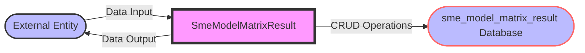

## Module: SmeModelMatrixResult.php
Based on the provided code snippet for a PHP module named `SmeModelMatrixResult.php`, here is a comprehensive analysis:

### Module Name
The module is identified as `SmeModelMatrixResult`.

### Primary Objectives
The primary purpose of this module is to serve as an Eloquent model for interacting with a database table named `sme_model_matrix_result`. It facilitates operations like creating, reading, updating, and deleting records from this table in an object-oriented manner.

### Critical Functions
While the provided code snippet does not explicitly define custom methods beyond the Laravel framework's default capabilities, it implicitly supports several critical functions through the Eloquent model it extends:
- **Creating records**: Insert new entries into the `sme_model_matrix_result` table.
- **Querying records**: Retrieve data from the table based on various criteria.
- **Updating records**: Modify existing entries in the table.
- **Deleting records**: Remove entries from the table.

### Key Variables
- `$table`: This protected variable explicitly specifies the database table name (`sme_model_matrix_result`) that the model is linked to.

### Interdependencies
This module depends on Laravel's Eloquent ORM system for its operations, particularly the `Model` class from which it inherits and the `HasFactory` trait it uses. These dependencies enable it to interact with the database seamlessly and support factory-based seeding for testing.

### Core vs. Auxiliary Operations
- **Core Operations**: The core operations involve database interactions for CRUD (Create, Read, Update, Delete) functionalities.
- **Auxiliary Operations**: While not explicitly defined in the snippet, auxiliary operations could include data validation, accessors and mutators for manipulating model data, and relationship definitions to other models.

### Operational Sequence
The operational sequence is determined by how an instance of this model is used in the application:
1. **Initialization**: An instance of `SmeModelMatrixResult` is created.
2. **Operation Execution**: Depending on the application logic, this can involve querying for data, inserting a new record, updating an existing one, or deleting a record.
3. **Finalization**: The operation completes, and the instance can be disposed of or reused for another operation.

### Performance Aspects
Performance considerations primarily involve how database interactions are managed:
- Efficient queries to avoid unnecessary data retrieval.
- Proper indexing of the `sme_model_matrix_result` table to speed up search operations.
- Minimizing the number of database connections and operations.

### Reusability
The model is designed with reusability in mind, adhering to the Eloquent ORM's conventions. It can be easily adapted or extended for similar database interactions in other parts of the application or in different projects with similar requirements.

### Usage
This model is used within a Laravel application to interact with the `sme_model_matrix_result` table. Developers can utilize it in controllers or services to perform database operations related to SME model matrix results.

### Assumptions
- The database table `sme_model_matrix_result` exists and is structured correctly to work with this model.
- Laravel's Eloquent ORM is correctly set up in the application.
- The environment is configured to use a database compatible with Eloquent (e.g., MySQL, PostgreSQL).
## Flow Diagram [via mermaid]

