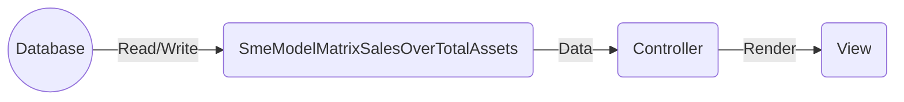

## Module: SmeModelMatrixSalesOverTotalAssets.php
Based on the provided code snippet for the module `SmeModelMatrixSalesOverTotalAssets.php`, here's a comprehensive analysis:

### Module Name
- **SmeModelMatrixSalesOverTotalAssets**

### Primary Objectives
- The primary purpose of this module is to define a model in an application, presumably part of a larger system, that represents the sales over total assets matrix for small and medium-sized enterprises (SMEs). This model serves as a data structure to interact with the corresponding database table.

### Critical Functions
- **use HasFactory;** - This trait inclusion allows the model to utilize Laravel's factory features, enabling the creation of model instances for testing or seeding the database easily.
- **protected $table;** - This property explicitly sets the database table associated with the model. It's critical for ensuring that the model interacts with the correct table, especially if the table's name does not follow Laravel's naming convention.

### Key Variables
- **$table** - This variable is essential as it defines the specific database table the model interacts with, which is `sme_model_matrix_sales_over_total_assets` in this case.

### Interdependencies
- This module depends on Laravel's Eloquent ORM system for model representation and database interaction. It also relies on the `HasFactory` trait for database seeding and testing functionalities.

### Core vs. Auxiliary Operations
- **Core Operations**: The core functionality of this module is to provide a structured representation of the `sme_model_matrix_sales_over_total_assets` table within the application, enabling CRUD operations on this table through the model.
- **Auxiliary Operations**: Utilizing the `HasFactory` trait for generating test data or seeding the database can be considered an auxiliary operation, supporting testing and development processes rather than the application's primary functionality.

### Operational Sequence
- There is no explicit operational sequence defined within this module itself. The sequence of operations would depend on how this model is utilized within the application, such as creating, reading, updating, or deleting records in the associated database table.

### Performance Aspects
- Performance considerations are not directly addressed in this module. However, efficient use of this model would involve optimizing database interactions, possibly through indexing the database table and minimizing expensive operations like JOINs if the table is part of complex queries.

### Reusability
- The model is designed with reusability in mind, as it abstracts the interaction with a specific database table. It can be instantiated and used wherever needed within the application to interact with the `sme_model_matrix_sales_over_total_assets` table.

### Usage
- This model is used to interact with the `sme_model_matrix_sales_over_total_assets` database table. Operations can include creating new records representing sales over total assets data for SMEs, reading existing records, updating them, or deleting them. It is likely used in parts of the application concerned with financial analysis or reporting for SMEs.

### Assumptions
- The module assumes that there is an existing database table named `sme_model_matrix_sales_over_total_assets` that follows the structure expected by the model.
- It assumes the Laravel framework's conventions and functionalities, particularly Eloquent ORM for model representation and database interaction, are being utilized in the application.
- It assumes that the use of the `HasFactory` trait is relevant to the application's development and testing processes, implying that seeding and factory-based testing are part of the development workflow.
## Flow Diagram [via mermaid]

