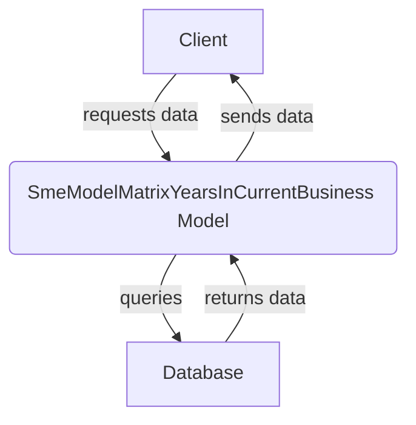

## Module: SmeModelMatrixYearsInCurrentBusiness.php
Given the provided code snippet for a PHP module, let's break down the analysis based on the requested aspects:

### Module Name
The module is named `SmeModelMatrixYearsInCurrentBusiness.php`.

### Primary Objectives
The primary purpose of this module is to define a model in a Laravel application that represents the data structure for storing information related to the years a Small and Medium-sized Enterprise (SME) has been in its current business. This model facilitates interactions with the corresponding database table.

### Critical Functions
- `use HasFactory;` - This trait inclusion enables the model to utilize Laravel's factory features for generating records of this model during testing or seeding the database conveniently.

### Key Variables
- `protected $table = 'sme_model_matrix_years_in_current_business';` - This variable explicitly sets the database table associated with the model, ensuring that all operations performed through this model are correctly mapped to the `sme_model_matrix_years_in_current_business` table.

### Interdependencies
This module depends on Laravel's Eloquent ORM system for its operations:
- It extends `Illuminate\Databaseloquent\Model`, indicating it relies on the methods and properties provided by Laravel's Eloquent ORM for interacting with the database.
- It uses `Illuminate\Databaseloquent\Factories\HasFactory`, suggesting it may interact with factory classes for generating data.

### Core vs. Auxiliary Operations
- **Core Operations**: The core functionality of this model is to represent the `sme_model_matrix_years_in_current_business` database table in the application's codebase, allowing for CRUD (Create, Read, Update, Delete) operations on the table's records.
- **Auxiliary Operations**: Utilizing the `HasFactory` trait for easier testing and database seeding can be considered an auxiliary operation, aiding in development and testing processes rather than the application's primary functionality.

### Operational Sequence
Since this is a model definition, there isn't a distinct operational sequence within this module itself. The sequence of operations would depend on how this model is used within the application, such as retrieving, creating, updating, or deleting records in the associated table.

### Performance Aspects
Performance considerations are not directly addressed within this module. However, performance can be influenced by how the model is used, especially in queries involving large datasets. Proper indexing of the database table and optimizing query logic in the application are crucial for maintaining good performance.

### Reusability
This model is highly reusable within the application for any functionality related to the years an SME has been in its current business. Its design follows Laravel's conventions, making it adaptable for various features that require interaction with the associated database table.

### Usage
The model is used within the Laravel application to interact with the `sme_model_matrix_years_in_current_business` table. This could include operations like querying the table for analysis, inserting new records when an SME registers or updates their business information, or deleting records if necessary.

### Assumptions
- The module assumes that there is a database table named `sme_model_matrix_years_in_current_business` that follows the structure expected by the model.
- It also assumes the Laravel framework's environment, given the use of Eloquent and the HasFactory trait.
- There's an implicit assumption about the existence of related factory classes for seeding/testing, inferred from the use of `HasFactory`.
## Flow Diagram [via mermaid]

