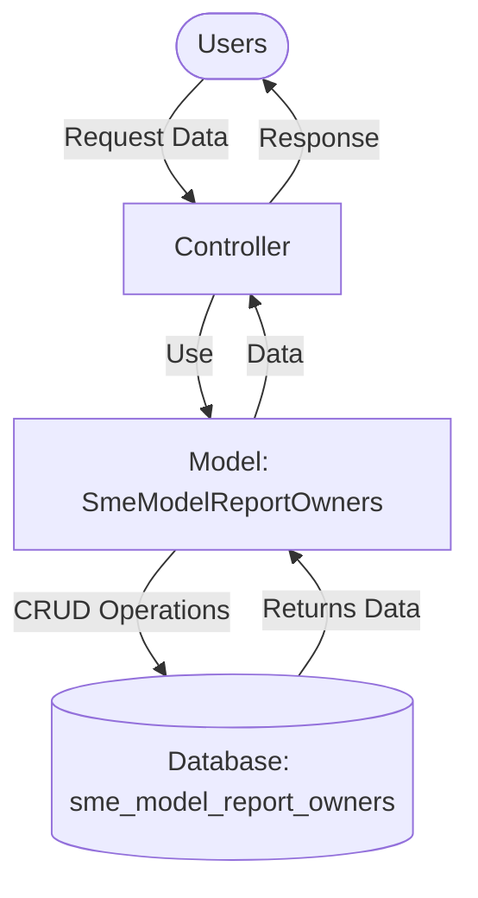

## Module: SmeModelReportOwners.php
Based on the provided code snippet, let's analyze the module `SmeModelReportOwners.php`.

### Module Name
The module is named `SmeModelReportOwners`.

### Primary Objectives
The primary objective of this module is to represent the "Report Owners" data model within a software system, likely part of an application using the Laravel framework. It serves as an ORM (Object-Relational Mapping) model to interact with the corresponding `sme_model_report_owners` table in a database.

### Critical Functions
- `HasFactory`: This trait allows the model to utilize the Laravel factory pattern for database seeding and testing. It is critical for generating mock data and facilitating testing.

### Key Variables
- `$table`: Specifies the exact table in the database that this model interacts with (`sme_model_report_owners`).
- `$guarded`: A security feature that prevents mass-assignment vulnerabilities for the specified array of attributes (`['id']`). It means all attributes except `id` are mass assignable.

### Interdependencies
This model depends on Laravel's Eloquent ORM system for its functionality, specifically:
- `Illuminate\Databaseloquent\Model`: The base class that provides ORM capabilities.
- `Illuminate\Databaseloquent\Factories\HasFactory`: A trait that enables the model to use factories for data generation.

### Core vs. Auxiliary Operations
**Core Operations:**
- Interacting with the `sme_model_report_owners` database table.
- Protecting the `id` attribute from mass assignment.

**Auxiliary Operations:**
- The use of the `HasFactory` trait can be considered auxiliary as it primarily supports testing and seeding rather than the model's main functionality.

### Operational Sequence
In this module, there isn't a distinct operational flow defined within the provided code snippet. The operations are primarily defined by the Eloquent ORM based on how the model is used in the application.

### Performance Aspects
Performance considerations are not directly addressed in this module. However, performance can be influenced by how the model is used, such as the complexity of queries made using this model and the size of the data being handled.

### Reusability
The model is designed with reusability in mind, as it adheres to Laravel's Eloquent ORM conventions. It can be easily reused within the application for any functionality related to the `sme_model_report_owners` table.

### Usage
This model would be used in the application wherever there is a need to interact with the `sme_model_report_owners` table. This could include creating, reading, updating, or deleting records of report owners.

### Assumptions
- The module assumes the existence of a database table named `sme_model_report_owners` that this model is mapped to.
- It assumes Laravel's Eloquent ORM is being used as the foundation for database interactions.
- The protection of the `id` field suggests an assumption that it is auto-incremented or otherwise managed by the database, not manually by the application.
## Flow Diagram [via mermaid]

